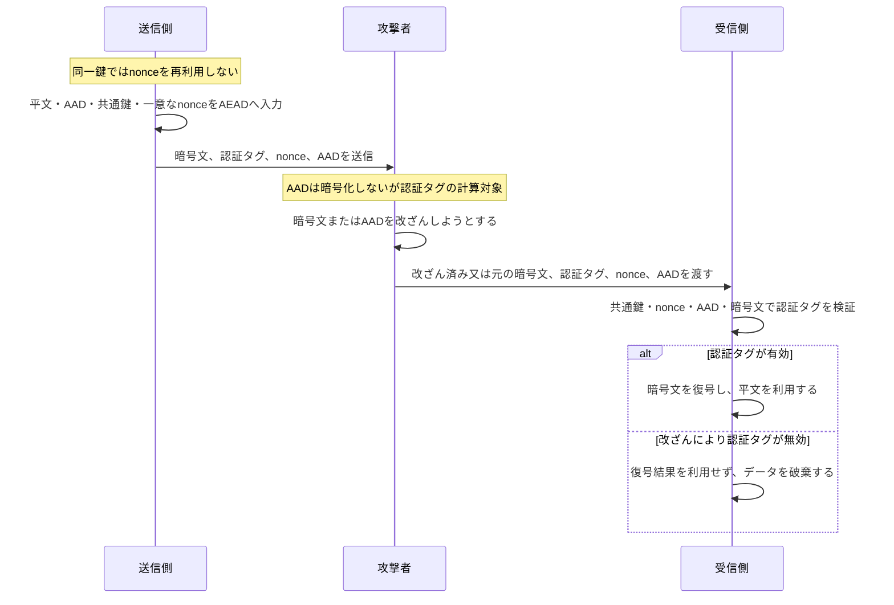

# AEADの暗号化と認証タグ検証

## 要点

- AEADは、平文を暗号化して機密性を守り、認証タグで暗号文とAADの改ざんを検知する。
- 暗号文は、平文を共通鍵とnonceで暗号化して作る。AADは暗号文には含めず、平文として送るが、認証タグの計算対象に含める。
- 認証タグは、暗号文・AAD・nonceを共通鍵に結び付けて計算する。受信側も同じ入力でタグを検証するため、いずれかが改ざんされると検証に失敗する。
- `nonce`は秘密ではないが、同一鍵の下で再利用してはならない。
- 認証タグの検証に失敗したデータは、内容を信用せず破棄する。
