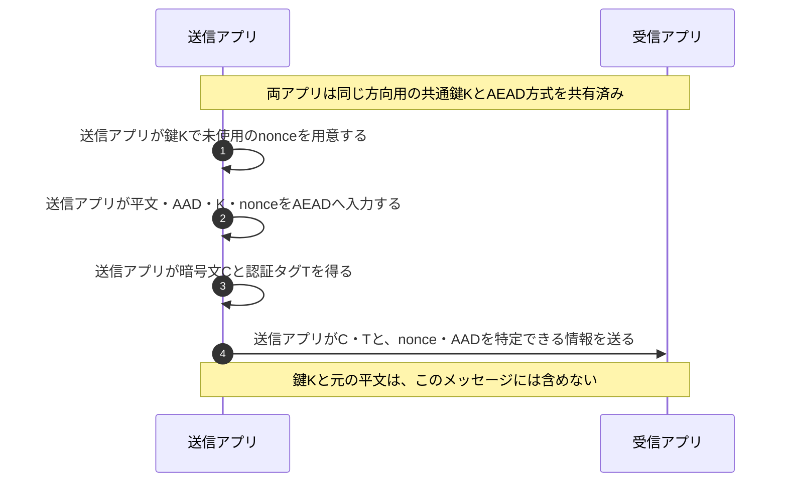
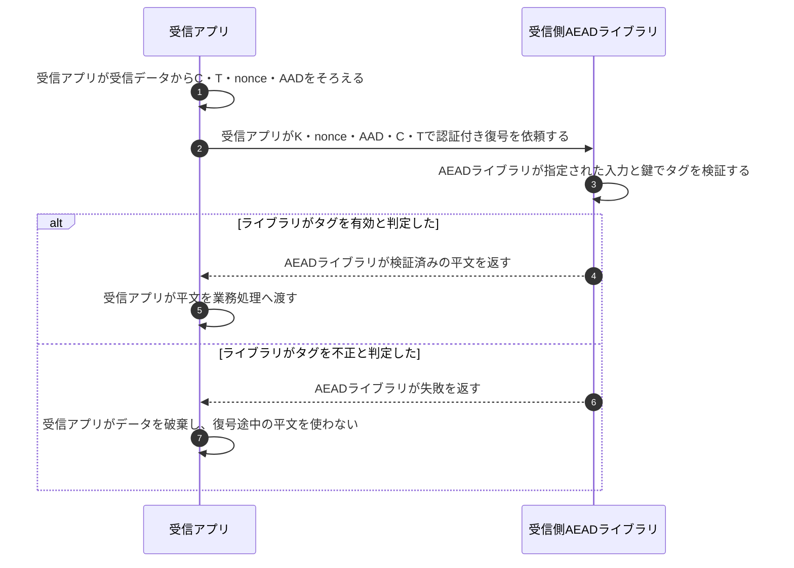

# AEADの暗号化と認証タグ検証

## 前提と登場人物

この図は、**送信アプリと受信アプリが同じ方向用の共通鍵Kを安全に共有済み**の場面を示す。鍵の確立や相手の本人確認はAEADとは別である。HTTPSで鍵を確立する過程は[TLS 1.3ハンドシェイク](TLS1.3ハンドシェイク.md)を参照する。

以下はAES-GCMのように同一鍵でnonceの一意性を要求する方式を想定する。AADは「暗号化しないが改ざんを検知したい付加情報」、nonceは「この鍵で今回の暗号化を区別する値」である。

## 全体像

図の内容を文字で読む

<!-- overview:start -->
要点: 共通鍵で改ざんを確認する。ログイン認証とは別。

補足: 同じ方向用の鍵Kを共有済み。タグ検証に失敗した平文は使わない。

| 段階 | 種類 | 主体 | 相手 | 内容 |
|---|---|---|---|---|
| 送信側 | 内部 | 送信アプリ | — | 鍵Kで未使用のnonceを用意する。 |
| 送信側 | 内部 | 送信アプリ | — | 平文・AAD・K・nonceから暗号文CとタグTを作る。 |
| 受渡し | 送信 | 送信アプリ | 受信アプリ | C・Tと、nonce・AADを特定できる情報を送る。鍵Kは送らない。 |
| 受信側 | 確認 | 受信アプリ／AEAD | — | 同じK・nonce・AADを使い、受信CとTを認証付き復号で検証する。 |
| 受信側 | 確認 | 受信アプリ | — | 成功なら平文を使う。不正なら破棄し、業務処理へ渡さない。 |
<!-- overview:end -->

詳しい手順・分岐を開く（Mermaid）

## 1. 送信アプリが暗号文とタグを作る

nonceやAADをどのように共有・再現するかは利用するプロトコルが定める。AEAD自体では、送受信側が同じ鍵・nonce・AADを使って検証できることが重要である。

## 2. 受信アプリがタグを検証してから平文を使う

アプリが平文を利用してよいのは認証タグの検証成功後だけである。通信路上で暗号文・AAD・nonce等が不正に変更されれば、通常はタグ検証に失敗する。

## 処理後に残るもの

| 主体 | 保持するもの | 保持・送信しないもの |
|---|---|---|
| 送信アプリ | 共通鍵K、nonceを重複させないための状態 | Kを暗号文に添えて送らない |
| 受信アプリ | 共通鍵K、検証成功後の平文 | タグ不正時の平文を業務処理へ渡さない |
| 通信路上の観測者 | 通信から見える暗号文・タグ・公開情報 | AEADだけを見てもKや平文は得られない |

## 注意点

**認証タグとログイン認証は別。** タグが確認するのは、鍵Kに対応する暗号文・AAD等の組合せの真正性と完全性である。共通鍵を共有する者同士を個人単位で識別する仕組みではない。利用者アカウントの確認はログイン認証等が担う。

**AES-GCMでは同一鍵でnonceを再利用しない。** 再利用すると機密性や認証の安全性が崩れるため、nonceは同じ鍵の下で重複させないことが重要である。具体的な攻撃式やプロトコルごとのnonce生成方法は暗記対象にしない。

## 参照資料

- [RFC 5116 §2・§5.1.1：AEADの入出力とGCMのnonce再利用](https://www.rfc-editor.org/rfc/rfc5116.html)
