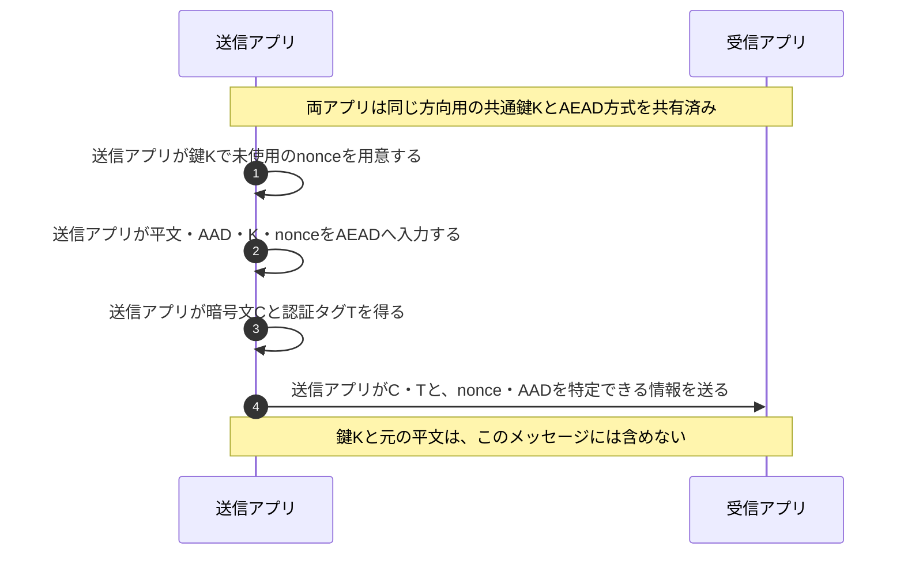
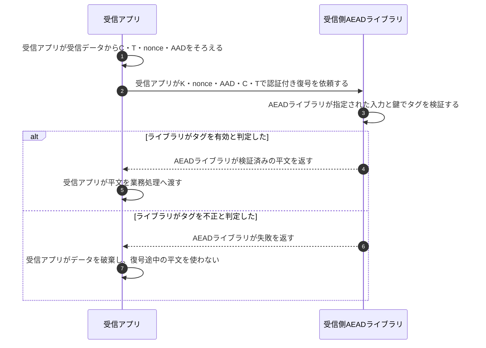

# AEADの暗号化と認証タグ検証

## 前提と登場人物

この図は、**送信アプリと受信アプリが同じ方向用の共通鍵Kを安全に共有済み**の場面を示す。鍵の確立や相手の本人確認はAEADとは別である。HTTPSで鍵を確立する過程は[TLS 1.3ハンドシェイク](TLS1.3ハンドシェイク.md)を参照する。

以下はAES-GCMのように同一鍵でnonceの一意性を要求する方式を想定する。AADは「暗号化しないが改ざんを検知したい付加情報」、nonceは「この鍵で今回の暗号化を区別する値」である。

## 1. 送信アプリが暗号文とタグを作る

nonceやAADを毎回そのまま送るとは限らない。TLS 1.3では、各端点が保持するIVとレコード連番からnonceを再現し、レコードヘッダをAADとして使う。

## 2. 受信アプリがタグを検証してから平文を使う

ライブラリ内部で復号とタグ計算を並行しても、アプリが平文を利用してよいのは検証成功後だけである。通信路上の攻撃者が暗号文・AAD・nonce等を変更すると、鍵を知らずに有効なタグを作ることは困難であり、通常は検証に失敗する。

## 処理後に残るもの

| 主体 | 保持するもの | 保持・送信しないもの |
|---|---|---|
| 送信アプリ | 共通鍵K、nonceを重複させないための状態 | Kを暗号文に添えて送らない |
| 受信アプリ | 共通鍵K、必要な受信連番等、検証成功後の平文 | タグ不正時の平文を業務処理へ渡さない |
| 通信路上の観測者 | 通信から見える暗号文・タグ・公開情報 | AEADだけを見てもKや平文は得られない |

## 注意点

**認証タグとログイン認証は別。** タグが確認するのは、鍵Kに対応する暗号文・AAD等の組合せの真正性と完全性である。共通鍵を共有する者同士を識別したり、業務データ自体の正しさを保証したりするものではない。利用者アカウントの確認はログイン認証等が担う。AEADだけでは、以前の正しい暗号文を再送するリプレイも一般には防げず、プロトコル側で連番などを管理する。

**AES-GCMでは同一鍵でnonceを再利用しない。** 同じ鍵とnonceでは暗号化に使うマスクが再利用され、`C1 XOR C2 = P1 XOR P2`の関係が漏れる。一方の平文が既知なら他方の推測につながり、タグの偽造にも影響する。鍵が十分長くても解決しない。nonceは秘密でなくてよいが、再起動後を含めた重複防止が必要である。

## 参照資料

- [RFC 5116 §2・§5.1.1：AEADの入出力とGCMのnonce再利用](https://www.rfc-editor.org/rfc/rfc5116.html)
- [RFC 8446 §5.2・§5.3：TLS 1.3のAADとレコードnonce](https://www.rfc-editor.org/rfc/rfc8446.html)
