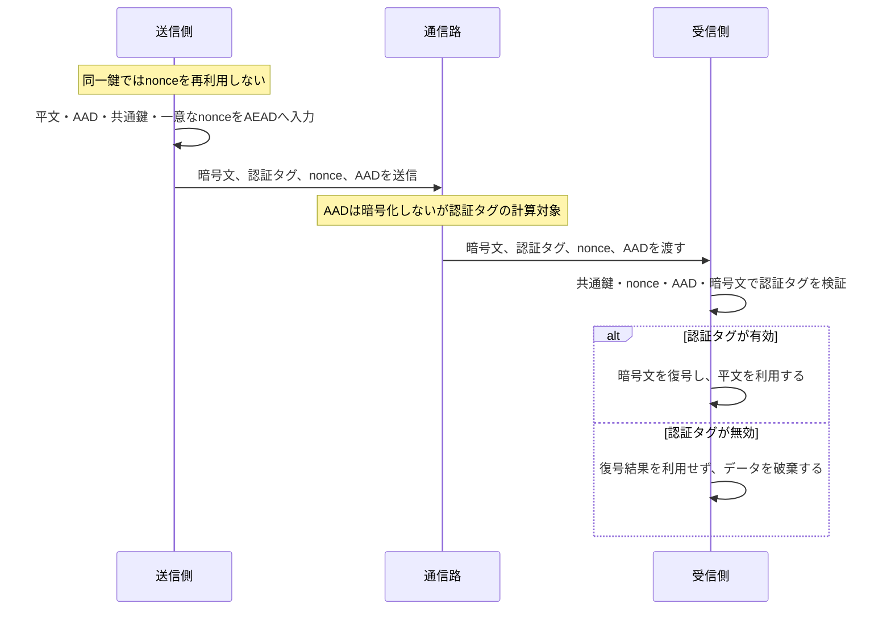

# AEADの暗号化と認証タグ検証

```mermaid
sequenceDiagram
    participant S as 送信側
    participant N as 通信路
    participant R as 受信側

    Note over S: 同一鍵ではnonceを再利用しない
    S->>S: 平文・AAD・共通鍵・一意なnonceをAEADへ入力
    S->>N: 暗号文、認証タグ、nonce、AADを送信
    Note over N: AADは暗号化しないが認証タグの計算対象
    N->>R: 暗号文、認証タグ、nonce、AADを渡す
    R->>R: 共通鍵・nonce・AAD・暗号文で認証タグを検証

    alt 認証タグが有効
        R->>R: 暗号文を復号し、平文を利用する
    else 認証タグが無効
        R->>R: 復号結果を利用せず、データを破棄する
    end
```

## 要点

- AEADは、平文を暗号化して機密性を守り、認証タグで暗号文とAADの改ざんを検知する。
- `nonce`は秘密ではないが、同一鍵の下で再利用してはならない。
- 認証タグの検証に失敗したデータは、内容を信用せず破棄する。
