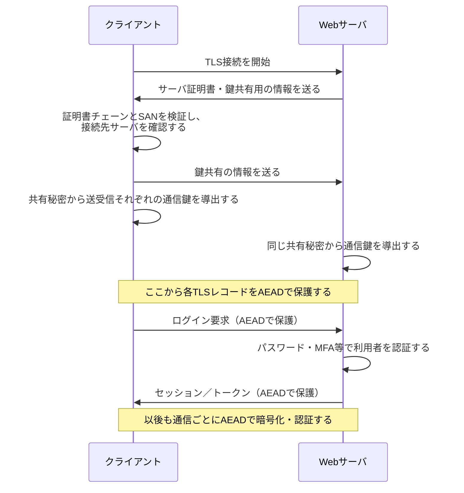
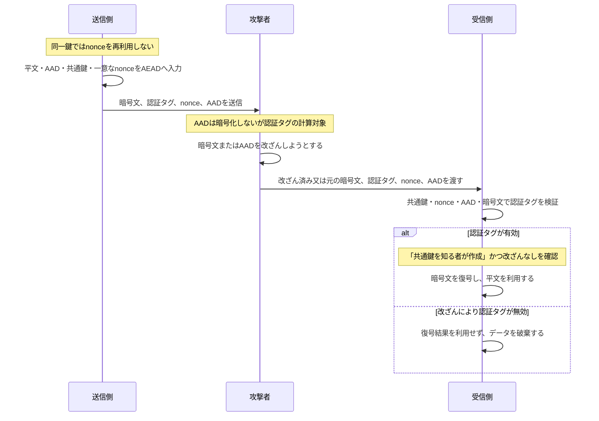
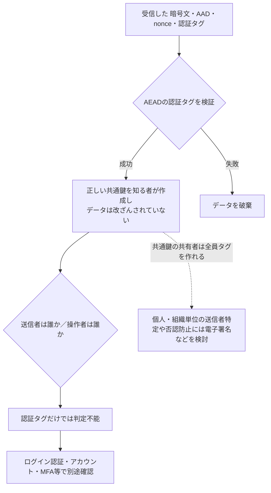

# AEADの暗号化と認証タグ検証

## AEADを使い始めるまで（HTTPSの例）

AEADそのものは「すでに両者が通信鍵を持つ」ことを前提とする。HTTPSでは、通常はTLSが先にサーバを認証して通信鍵を導出し、その通信鍵でAEADを使い始める。利用者のログインは、その保護された通信路の上で行う別の処理である。

- **TLSのサーバ認証**: 接続先が、そのドメイン用の秘密鍵を持つサーバかを証明書で確認する。
- **鍵確立**: TLSの鍵共有で、盗聴者には分からない通信鍵を双方が導出する。AEADはこの後で使う。
- **ログイン認証**: 通信路の利用者がどのアカウントかをアプリケーションが確認する。TLSや認証タグだけでログイン済みとはならない。

## 通信中のAEAD暗号化と認証タグ検証

## 要点

- AEADは、平文を暗号化して機密性を守り、認証タグで暗号文とAADの改ざんを検知する。
- 暗号文は、平文を共通鍵とnonceで暗号化して作る。AADは暗号文には含めず、平文として送るが、認証タグの計算対象に含める。
- 認証タグは、**暗号文とAADが改ざんされていないか**を確認するための値である。送信側は共通鍵とnonceを使い、暗号文・AAD（方式により長さなどの付帯情報も含む）に対応するタグを作る。
- 受信側は、受信した暗号文・AAD・nonceと同じ共通鍵でタグを検証する。暗号文またはAADを1ビットでも変えると正しいタグと一致しなくなるため、検証に失敗する。nonceもタグを対応付ける入力の一部であり、別のnonceへ差し替えても検証は通らない。
- これは「内容が正しい」という意味ではなく、**正しい鍵を知る者が作った、改ざんされていない入力の組合せ**であることを確かめる。例えば、正しい鍵を持つ送信側が誤った業務データを暗号化しても、タグは有効になり得る。
- `nonce`は秘密ではないが、同一鍵の下で再利用してはならない。
- 認証タグの検証に失敗したデータは、内容を信用せず破棄する。

## nonce再利用が危険な理由

- nonceは、同じ鍵から**送信ごとに異なる暗号用の疑似乱数列（使い捨てマスク）**を作らせるための番号と捉えるとよい。鍵が十分に強くても、同一鍵・同一nonceを使えば同じマスクを2回使うことになり、方式が前提とする安全性が崩れる。
- ストリーム暗号に近い部分では、`C1 = P1 XOR mask` と `C2 = P2 XOR mask` のようになる。同じ`mask`を再利用すると、`C1 XOR C2 = P1 XOR P2` が分かってしまう。平文の一方が推測できる場合や、形式・既知部分がある場合には、もう一方の内容の推測につながる。これはワンタイムパッドで同じパッドを二度使ってはいけないのと同じ発想である。
- AES-GCMでは機密性だけでなく認証にも影響する。nonceを再利用すると認証タグの計算に関する情報も漏れ得るため、条件によっては攻撃者が偽造タグを作れるおそれがある。
- 結論: **AES-GCMでは同一鍵の下でnonceを絶対に再利用しない。** nonceは秘密にする必要はないが、送信のたびに一意でなければならない。再起動後も連番が重複しない設計、またはライブラリが定める安全なnonce生成方法を使う。

## 認証タグとログイン認証の役割分担

- 認証タグは、**データに対する認証**であり、「正しい共通鍵を知る者が作成したか」を確かめる。
- ログイン認証は、**人・アカウントに対する認証**であり、「誰がいま操作しているか」を確かめる。
- 共通鍵を共有する主体をタグだけで区別できないため、AEADの認証タグは本人認証や否認防止の代わりにはならない。

## 参考資料

- [イラストで正しく理解するTLS 1.3の暗号技術（光成滋生）](https://zenn.dev/herumi/articles/tls1_3_crypto): TLSで鍵共有の後にAEADを使い始める流れと、認証タグの働きを図で確認するための補助資料。
