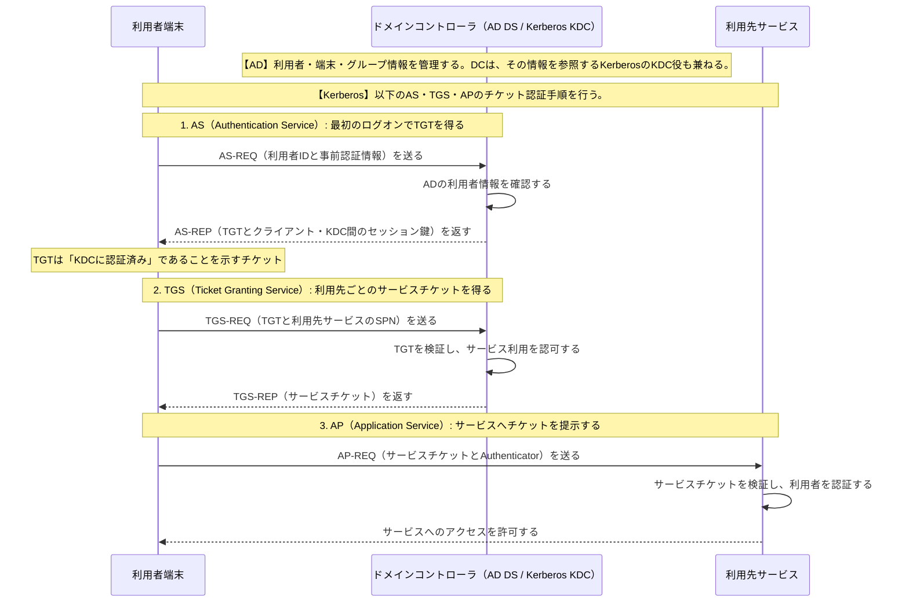

# Active DirectoryとKerberosのチケット認証

## 要点

- ADは利用者・端末・グループなどを集中管理する基盤であり、ドメインコントローラがKerberosのKDCとして認証を提供する。
- 図の`【Kerberos】`と示した範囲にある`AS-REQ / AS-REP / TGS-REQ / TGS-REP / AP-REQ`、TGT、サービスチケットの流れが**Kerberos**である。ADそのものは認証方式ではなく、KerberosのKDCが参照する利用者・端末・グループ情報などを管理する基盤である。
- 利用者端末は最初にTGTを得て、その後はサービスごとにサービスチケットを取得する。パスワードを各サービスへ繰り返し送らない。
- `SPN`はサービスを識別する名前であり、KDCはTGTとSPNを基に、そのサービス用チケットを発行する。
