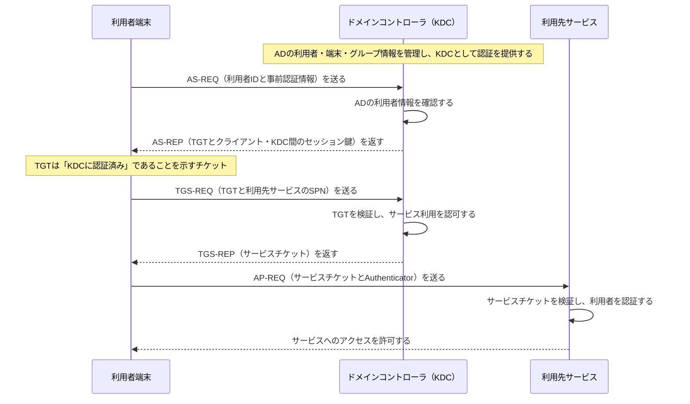

# Active DirectoryとKerberosのチケット認証

## 要点

- ADは利用者・端末・グループなどを集中管理する基盤であり、ドメインコントローラがKerberosのKDCとして認証を提供する。
- 利用者端末は最初にTGTを得て、その後はサービスごとにサービスチケットを取得する。パスワードを各サービスへ繰り返し送らない。
- `SPN`はサービスを識別する名前であり、KDCはTGTとSPNを基に、そのサービス用チケットを発行する。
