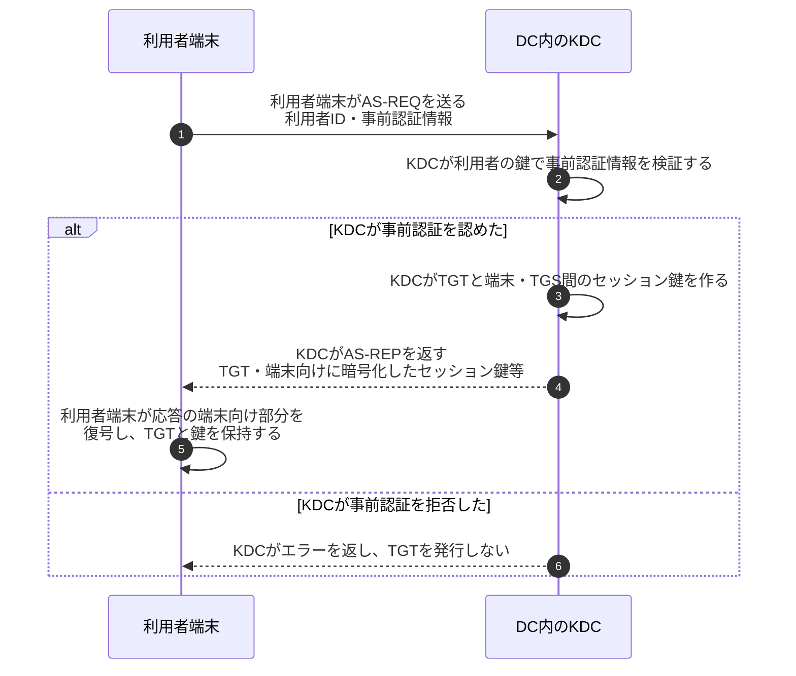
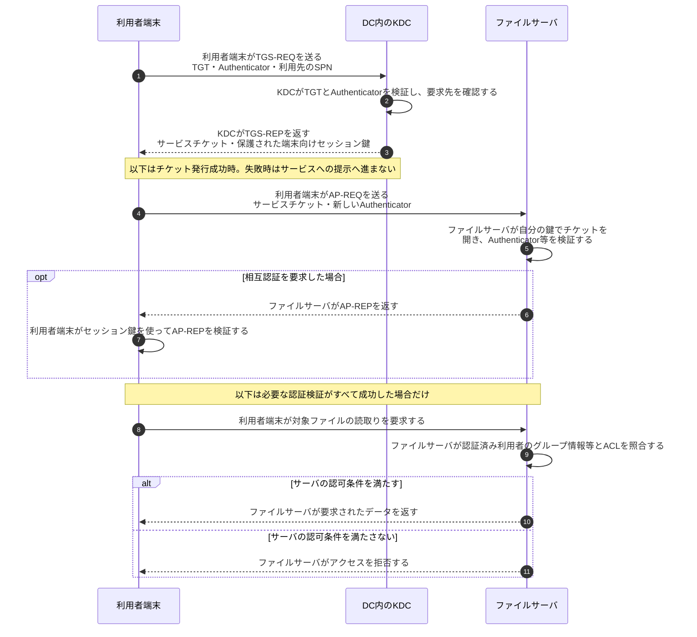

# Active DirectoryとKerberosのチケット認証

## 前提と登場人物

**AD DSは利用者・端末・グループ等の管理基盤、Kerberosはチケットを使う認証方式**である。ADドメインのDC（ドメインコントローラ）がKDCを担当する。ASとTGSはKDC内の役割であり、別の物理サーバという意味ではない。

利用者端末、DC、利用先のファイルサーバを区別する。以下は同一ドメインの基本例で、パスワード由来の鍵による事前認証を想定する。証明書等を使う事前認証、紹介チケット、委任は省略する。

## 全体像

図の内容を文字で読む

<!-- overview:start -->
要点: TGTはKDC用。サービスチケットは利用先用。

補足: ASとTGSはDC内KDCの役割。鍵は保護して配布し、認証成功と認可を分ける。

| 段階 | 種類 | 主体 | 相手 | 内容 |
|---|---|---|---|---|
| TGTを取得 | 送信 | 利用者端末 | DC内KDC（AS） | 利用者IDと事前認証情報をAS-REQで送る。 |
| TGTを取得 | 送信 | DC内KDC（AS） | 利用者端末 | 検証成功後、TGTと保護した端末向けセッション鍵を返す。 |
| 利用先のチケットを取得 | 送信 | 利用者端末 | DC内KDC（TGS） | TGT・Authenticator・利用先のSPNを送る。 |
| 利用先のチケットを取得 | 送信 | DC内KDC（TGS） | 利用者端末 | 検証成功後、サービスチケットと保護したセッション鍵を返す。 |
| 利用先で確認 | 送信 | 利用者端末 | ファイルサーバ | サービスチケットと新しいAuthenticatorを提示する。 |
| 利用先で確認 | 確認 | ファイルサーバ | — | チケット等で認証する。さらにグループ情報とACLで操作を認可する。 |
<!-- overview:end -->

詳しい手順・分岐を開く（Mermaid）

## 1. 利用者端末がTGTを取得する（AS交換）

TGT内部はKDC側の鍵で保護される。端末がTGTを持つことと、TGTの中身を自由に読めることは別である。セッション鍵もネットワークへ平文で送らない。

## 2. 利用者端末がサービス用チケットを取得・提示する

**TGT・サービスチケットによる認証と、ファイルに触ってよいかという認可は別。** KDCの発行ポリシーがあっても、サービスチケットを持つだけで全ファイルへアクセスできるわけではない。ADではPAC等の認可情報を利用できるが、利用先サービス側でもアクセス制御を行う。

## 処理後に残るもの

| 主体 | 保持するもの | 相手へ渡さないもの |
|---|---|---|
| 利用者端末 | 有効期間内のTGT、サービスチケット、対応するセッション鍵 | 利用者のパスワードを各サービスへ繰り返し送らない |
| DC内のKDC | アカウント情報、チケット保護・発行に必要な鍵 | KDCの長期秘密情報 |
| ファイルサーバ | サービスの鍵、ACL、認証後の接続状態・再送検出情報 | サービスの長期鍵 |

## 注意点

SPNは利用先サービスの識別名である。Authenticatorはチケットとは別で、セッション鍵で保護した時刻等を含み、鍵の保有と再送でないことの確認に使う。TGTそのものをファイルサーバへの入場券として使うわけではない。

## 参照資料

- [RFC 4120 §1.4・§3：Kerberosの認証・認可の区別と各交換](https://www.rfc-editor.org/rfc/rfc4120.html)
- [Microsoft：Kerberos authentication overview](https://learn.microsoft.com/en-us/windows-server/security/kerberos/kerberos-authentication-overview)
