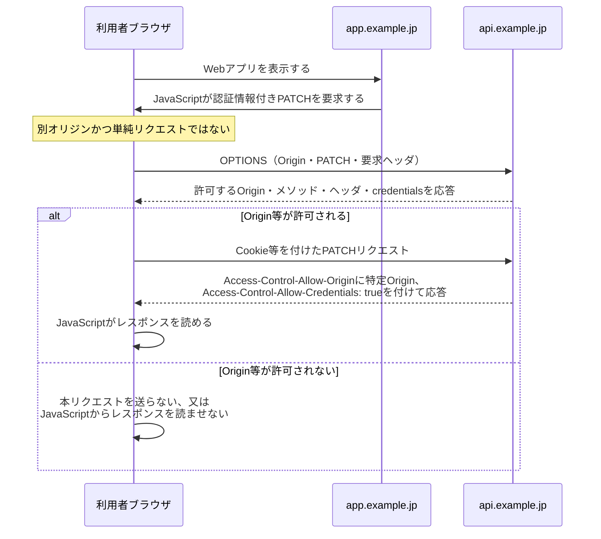

# CORSのpreflightと認証情報付きリクエスト

## 要点

- CORSは、別オリジンのページ上のJavaScriptがレスポンスを読めるかをブラウザが制御する仕組みである。HTTPリクエストをネットワーク上で完全に止める仕組みではない。
- `PATCH`、非単純ヘッダ、JSONなどの条件では、ブラウザが本リクエストの前にOPTIONSのpreflightで許可を確認し得る。
- Cookieなどの認証情報を伴うCORSでは、サーバは許可するOriginを具体的に返し、`Access-Control-Allow-Credentials: true`を返す。`Access-Control-Allow-Origin: *`と認証情報の許可は併用できない。
