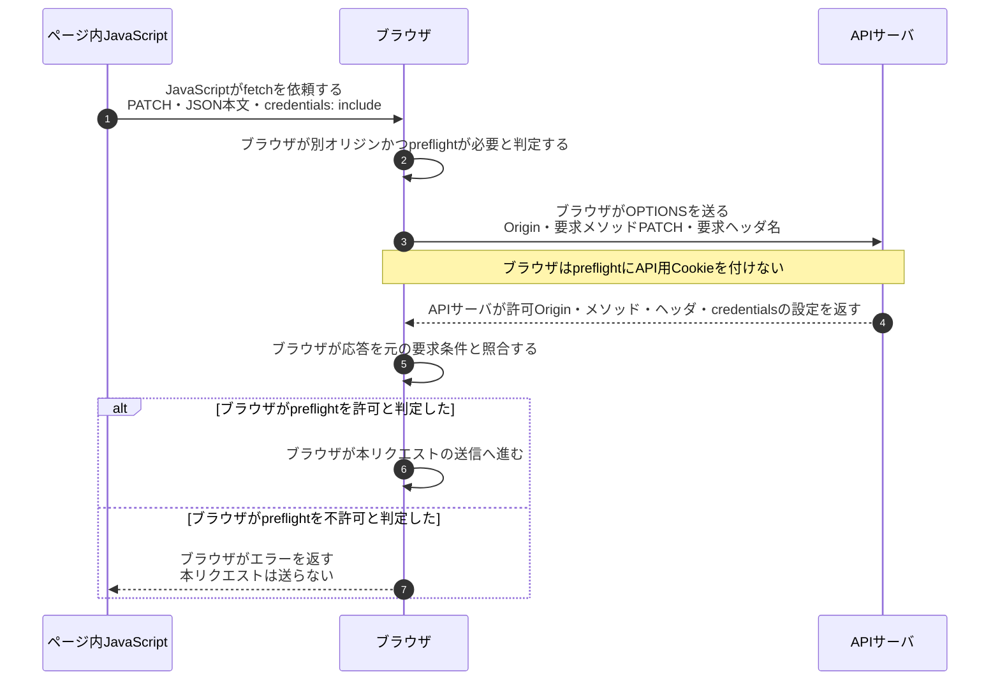
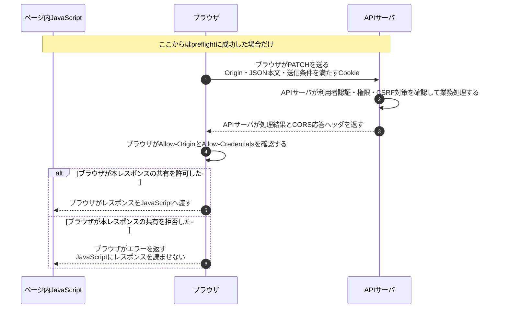

# CORSのpreflightと認証情報付きリクエスト

## 前提と登場人物

`https://app.example.jp`のページから`https://api.example.jp`へ、Cookieを使うPATCHを送る例である。**JavaScriptは配信元サーバではなく、利用者のブラウザ内で実行される。** 図のJavaScriptとブラウザは同じ端末内の別の役割で、APIサーバだけが通信先である。

ページの読込みは済んでおり、preflightの許可キャッシュはないものとする。API用Cookieの送信は、`credentials: include`に加え、Domain・Path・Secure・SameSiteやブラウザのCookieポリシーにも従う。

## 全体像

図の内容を文字で読む

<!-- overview:start -->
要点: CORSの許可を確認するのはブラウザ。

補足: Cookie付きPATCHの例。読取り拒否は、APIで済んだ業務処理の取消ではない。

| 段階 | 種類 | 主体 | 相手 | 内容 |
|---|---|---|---|---|
| 送る前：preflight | 送信 | ブラウザ | APIサーバ | OPTIONSでOrigin・PATCH・要求ヘッダ名を通知する。Cookieは付けない。 |
| 送る前：preflight | 送信 | APIサーバ | ブラウザ | 許可Origin・メソッド・ヘッダ・credentialsの設定を返す。 |
| 送る前：preflight | 確認 | ブラウザ | — | 応答が要求条件に合えば本送信へ。不許可なら本リクエストを送らない。 |
| 許可後：本リクエスト | 送信 | ブラウザ | APIサーバ | PATCH本文とOriginを送る。Cookieは送信条件を満たす場合だけ付ける。 |
| 許可後：本リクエスト | 送信 | APIサーバ | ブラウザ | 認証・認可・CSRF対策を確認して処理し、結果とCORSヘッダを返す。 |
| 受信後：読取り | 確認 | ブラウザ | — | 本レスポンスのCORS条件を確認し、許可時だけJavaScriptへ渡す。 |
<!-- overview:end -->

詳しい手順・分岐を開く（Mermaid）

## 1. ブラウザが本リクエストの送信条件を確認する

## 2. ブラウザが本レスポンスの読取りを許可する

2番目の失敗では、**APIサーバの業務処理が既に実行されている可能性がある**。CORSエラーは処理の巻戻しを意味しない。preflightなしで送れるリクエストもあり、CORSは[CSRF対策](CSRFトークンとSameSite.md)の代わりにはならない。

## 処理後に残るもの

| 主体 | 保持するもの・変化する状態 |
|---|---|
| ブラウザ | API用Cookie、条件に応じたpreflight許可キャッシュ |
| ページ内JavaScript | ブラウザが共有を許可したレスポンス。HttpOnly Cookieは直接読めない |
| APIサーバ | 認証・認可の設定、CORS許可設定、実行済み業務処理の結果 |

## 注意点

認証情報付きのレスポンスを共有する場合、`Access-Control-Allow-Origin`は`https://app.example.jp`のように具体的なOriginを返し、`Access-Control-Allow-Credentials: true`も返す。`*`は使わない。Originを無条件で反射して許可してはならない。

## 参照資料

- [WHATWG Fetch §3.3・§4.8：CORS、credentials、preflight](https://fetch.spec.whatwg.org/)
