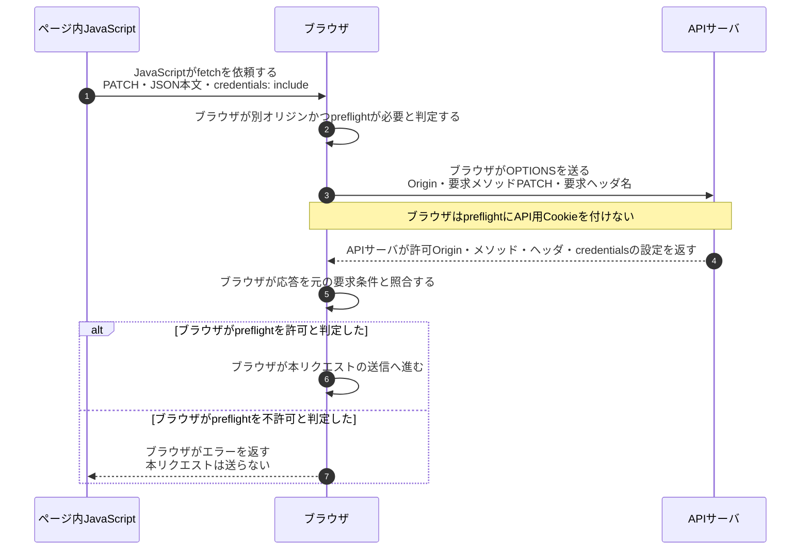
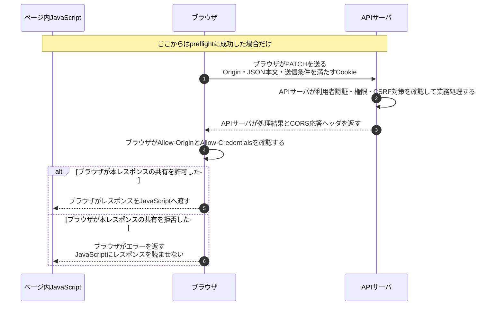

# CORSのpreflightと認証情報付きリクエスト

## 前提と登場人物

`https://app.example.jp`のページから`https://api.example.jp`へ、Cookieを使うPATCHを送る例である。**JavaScriptは配信元サーバではなく、利用者のブラウザ内で実行される。** 図のJavaScriptとブラウザは同じ端末内の別の役割で、APIサーバだけが通信先である。

ページの読込みは済んでおり、preflightの許可キャッシュはないものとする。API用Cookieの送信は、`credentials: include`に加え、Domain・Path・Secure・SameSiteやブラウザのCookieポリシーにも従う。

## 1. ブラウザが本リクエストの送信条件を確認する

## 2. ブラウザが本レスポンスの読取りを許可する

2番目の失敗では、**APIサーバの業務処理が既に実行されている可能性がある**。CORSエラーは処理の巻戻しを意味しない。preflightなしで送れるリクエストもあり、CORSは[CSRF対策](CSRFトークンとSameSite.md)の代わりにはならない。

## 処理後に残るもの

| 主体 | 保持するもの・変化する状態 |
|---|---|
| ブラウザ | API用Cookie、条件に応じたpreflight許可キャッシュ |
| ページ内JavaScript | ブラウザが共有を許可したレスポンス。HttpOnly Cookieは直接読めない |
| APIサーバ | 認証・認可の設定、CORS許可設定、実行済み業務処理の結果 |

## 注意点

認証情報付きのレスポンスを共有する場合、`Access-Control-Allow-Origin`は`https://app.example.jp`のように具体的なOriginを返し、`Access-Control-Allow-Credentials: true`も返す。`*`は使わない。Originを無条件で反射して許可してはならない。

## 参照資料

- [WHATWG Fetch §3.3・§4.8：CORS、credentials、preflight](https://fetch.spec.whatwg.org/)
