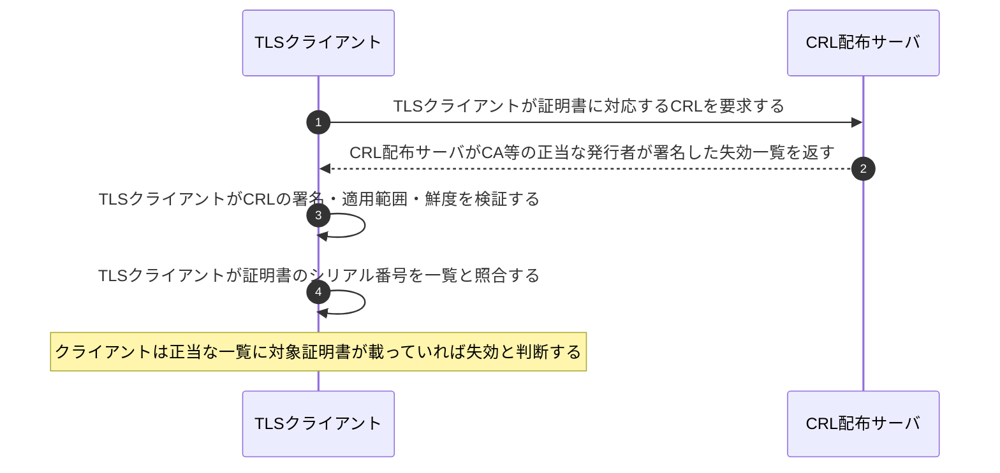
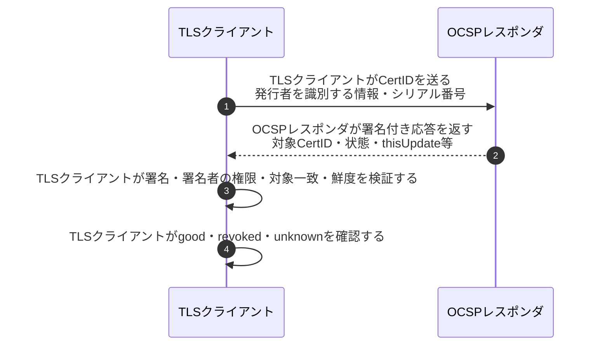
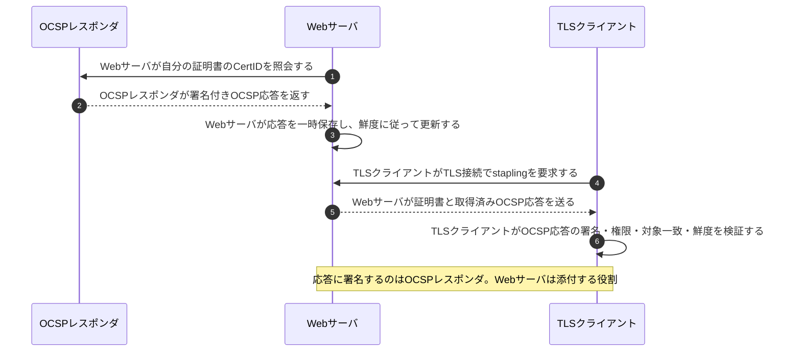

# CRLとOCSPの失効確認

## 前提と登場人物

**失効確認を行うTLSクライアント**がWebサーバの証明書を受け取った場面である。CRL配布サーバ、OCSPレスポンダ、Webサーバを区別する。以下は3つの方式の比較であり、全クライアントが毎接続で全部を実施するという意味ではない。キャッシュや製品の方針により実際の通信は異なる。

## 全体像

図の内容を文字で読む

<!-- overview:start -->
要点: 取得する人が違っても、最後に確認するのはクライアント。

補足: 以下は三つの方式の比較。失効確認だけで証明書の全検査が済むわけではない。

| 段階 | 種類 | 主体 | 相手 | 内容 |
|---|---|---|---|---|
| 方式1：CRL | 交換 | TLSクライアント | CRL配布サーバ | 失効一覧を要求し、正当な発行者が署名したCRLを受け取る。 |
| 方式1：CRL | 確認 | TLSクライアント | — | CRLの署名・範囲・鮮度を検証し、シリアル番号を照合する。 |
| 方式2：OCSP | 交換 | TLSクライアント | OCSPレスポンダ | 対象CertIDを照会し、署名付きの証明書状態を受け取る。 |
| 方式2：OCSP | 確認 | TLSクライアント | — | 署名者の権限・対象・鮮度等を検証し、good／revoked／unknownを確認する。 |
| 方式3：OCSP stapling | 交換 | Webサーバ | OCSPレスポンダ | 自分の証明書のOCSP応答を先に取得し、期限付きで保存する。 |
| 方式3：OCSP stapling | 送信 | Webサーバ | TLSクライアント | TLS接続時、証明書に取得済みの署名付きOCSP応答を添える。 |
| 方式3：OCSP stapling | 確認 | TLSクライアント | — | 添付されたOCSP応答も、自分で署名・権限・対象・鮮度を検証する。 |
<!-- overview:end -->

詳しい手順・分岐を開く（Mermaid）

## 1. CRL：クライアントが一覧を取得して照合する

## 2. OCSP：クライアントが対象証明書の状態を照会する

## 3. OCSP stapling：Webサーバが先に応答を取得して添える

## 処理後に残るもの

| 主体 | 保持するもの |
|---|---|
| TLSクライアント | 対象証明書、信頼情報、方針に応じたCRL・OCSPのキャッシュ |
| Webサーバ | 自分の証明書・秘密鍵、stapling用の期限付きOCSP応答 |
| CRL発行者／OCSPレスポンダ | 失効情報、署名用の秘密鍵。秘密鍵自体は応答に含めない |

## 注意点

`revoked`と、`unknown`・タイムアウト・古い応答は同じではない。確認不能時に中止するか、別の情報源を試すか等はクライアントの方針や要件による。**「確認できなければ全ブラウザが必ず切断する」とは限らない。**

`good`は「証明書の全検査に合格」を意味しない。有効期間、接続先名、チェーン等は[別途検証](証明書チェーン検証.md)する。OCSP応答はある時点の状態であり、キャッシュ後の失効が瞬時に反映されるとは限らない。

## 参照資料

- [RFC 5280 §5・§6.3：CRLの検証](https://www.rfc-editor.org/rfc/rfc5280.html)
- [RFC 6960 §2.2・§3.2：OCSP状態と応答の受入条件](https://www.rfc-editor.org/rfc/rfc6960.html)
- [RFC 6066 §8：Certificate Status Request](https://www.rfc-editor.org/rfc/rfc6066.html)
