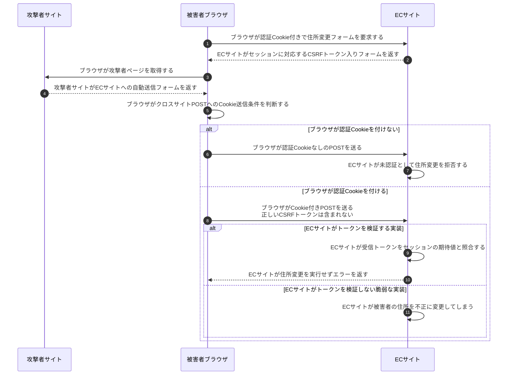

# CSRFトークンとSameSite

## 前提と登場人物

被害者はECサイトへログイン済みで、**ブラウザが認証Cookieを保持**している。ECサイトはセッションに結び付いた予測不能なCSRFトークンを正規フォームへ埋め込む方式とする。攻撃者サイトは別サイトで、正規フォームのトークンを読めず、ECサイトにXSSはないものとする。

## 全体像

図の内容を文字で読む

<!-- overview:start -->
要点: SameSiteはブラウザ。トークン検証はWebサイト。

補足: ログイン済みの被害者を想定。攻撃者は正しいCSRFトークンを読めない。

| 段階 | 種類 | 主体 | 相手 | 内容 |
|---|---|---|---|---|
| 正規フォームの準備 | 送信 | ECサイト | 被害者ブラウザ | 正規フォームの要求に、セッションと結び付いたCSRFトークンを返す。 |
| 攻撃者の誘導 | 送信 | 攻撃者サイト | 被害者ブラウザ | ECサイトへ自動POSTする偽フォームを渡す。 |
| ブラウザの判断 | 確認 | 被害者ブラウザ | — | SameSite等でCookieを付けるか判断する。POST自体を必ず止めるわけではない。 |
| 不正な要求 | 送信 | 被害者ブラウザ | ECサイト | 正しいトークンのないPOSTを送る。Cookieの有無は送信条件による。 |
| ECサイトの判断 | 確認 | ECサイト | — | 未認証なら拒否。Cookieがあってもトークンが不一致なら変更を実行しない。 |
<!-- overview:end -->

詳しい手順・分岐を開く（Mermaid）

## 攻撃を止める主体はどこか

## 処理後に残るもの

| 主体 | 保持するもの・結果 |
|---|---|
| 被害者ブラウザ | ECサイトのCookieと正規フォームのトークン。別サイトのスクリプトへ自由に渡さない |
| ECサイト | セッションとトークンの対応。検証失敗なら住所は変更しない |
| 攻撃者サイト | 偽フォーム。通常、ECサイトの正しいトークンは保持しない |

## 注意点

**SameSiteを実施するのはブラウザ、トークンを検証するのはECサイト。** 明示的な`SameSite=Lax`は通常のクロスサイトPOSTへのCookie送信を制限し、`Strict`はさらに厳しく制限する。Laxにはトップレベルの安全なメソッドによる遷移等の例外があり、状態変更をGETで実装してはいけない。属性省略時の挙動と明示的Laxも区別する。

SameSiteは「リクエストそのものを必ず送らなくする」設定ではない。またsiteとoriginは同一概念ではなく、同一site内の別originからの攻撃やXSSへの万能策ではない。[CORS](CORSのpreflightと認証情報付きリクエスト.md)によるレスポンス読取り制限とも役割が異なる。

## 参照資料

- [OWASP：CSRF Prevention Cheat Sheet（Synchronizer Token・SameSite）](https://cheatsheetseries.owasp.org/cheatsheets/Cross-Site_Request_Forgery_Prevention_Cheat_Sheet.html)
