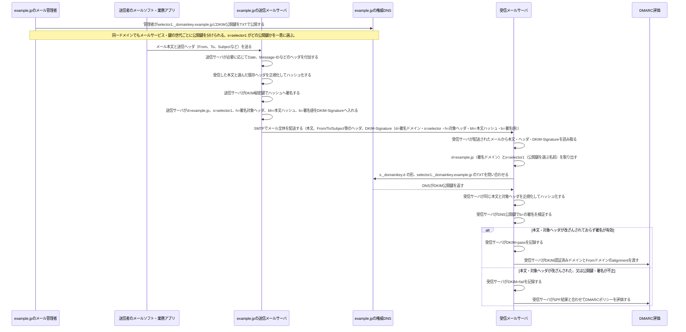

# DKIMの署名と検証

DKIM（DomainKeys Identified Mail）は、送信側がメールの本文と選択したヘッダへ電子署名を付け、受信側がDNSで公開鍵を取得して検証する仕組みです。これにより、署名対象が配送中に改ざんされていないことと、`d=`で示すドメインの管理者が署名したことを確認します。

## 覚えるポイント

- `d=`は署名ドメイン（「どのドメインの管理者が署名したか」を示す）、`s=`はそのドメイン内で使う公開鍵を一意に選ぶselector（鍵の世代・用途を分ける名前）である。同じドメインが複数のメールサービスを使う場合や鍵をローテーションする場合も、`s=`で対応する公開鍵を区別できる。受信側は`<selector>._domainkey.<d=>`、すなわち`<s>._domainkey.<d>`をDNSで引く。
- `DKIM-Signature`には、図で示した`d=`・`s=`・`h=`・`bh=`・`b=`のほか、通常は`v=1`（DKIMのバージョン）、`a=`（署名アルゴリズム。例: `rsa-sha256`）、`c=`（canonicalization方式。空白・改行の差異をどこまで許容するか。例: `relaxed/relaxed`）も入る。
- 必要に応じて、`t=`（署名時刻）、`x=`（署名の有効期限）、`i=`（署名者の識別子）、`l=`（本文のうち署名対象にするバイト数）も含められる。
- 秘密鍵は送信メールサーバだけが保持し、DNSへ公開するのは公開鍵である。
- 本文とFrom・To・Subjectなどの送信ヘッダは、送信者のメールソフトや業務アプリがメールサーバへ渡す。送信サーバもDateやMessage-IDなどを付加でき、その中から署名対象の既存ヘッダを選んで署名する。
- DKIMが守るのは署名対象に含めた本文・ヘッダだけである。署名対象外のヘッダ追加や、メーリングリストによる本文変更などは、構成によって検証結果へ影響する。
- `DKIM=pass`だけでは表示上の差出人が正当とは言い切れない。DMARCでは、DKIMの`d=`ドメインと表示上の`From`ドメインがalignmentしているかも確認する。
- DKIMの失敗は直ちに受信拒否を意味しない。SPF結果とDMARCの`p=`ポリシーを合わせて、受信・隔離・拒否を判断する。
