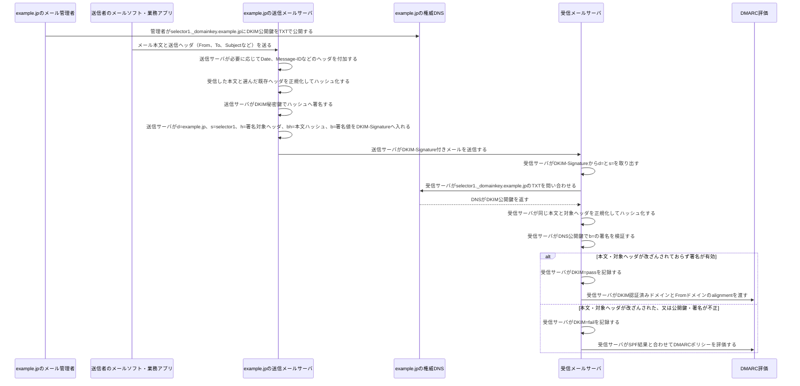

# DKIMの署名と検証

DKIM（DomainKeys Identified Mail）は、送信側がメールの本文と選択したヘッダへ電子署名を付け、受信側がDNSで公開鍵を取得して検証する仕組みです。これにより、署名対象が配送中に改ざんされていないことと、`d=`で示すドメインの管理者が署名したことを確認します。

## 覚えるポイント

- `d=`は署名ドメイン、`s=`は公開鍵を選ぶselectorである。受信側は`<selector>._domainkey.<d=>`をDNSで引く。
- 秘密鍵は送信メールサーバだけが保持し、DNSへ公開するのは公開鍵である。
- 本文とFrom・To・Subjectなどの送信ヘッダは、送信者のメールソフトや業務アプリがメールサーバへ渡す。送信サーバもDateやMessage-IDなどを付加でき、その中から署名対象の既存ヘッダを選んで署名する。
- DKIMが守るのは署名対象に含めた本文・ヘッダだけである。署名対象外のヘッダ追加や、メーリングリストによる本文変更などは、構成によって検証結果へ影響する。
- `DKIM=pass`だけでは表示上の差出人が正当とは言い切れない。DMARCでは、DKIMの`d=`ドメインと表示上の`From`ドメインがalignmentしているかも確認する。
- DKIMの失敗は直ちに受信拒否を意味しない。SPF結果とDMARCの`p=`ポリシーを合わせて、受信・隔離・拒否を判断する。
