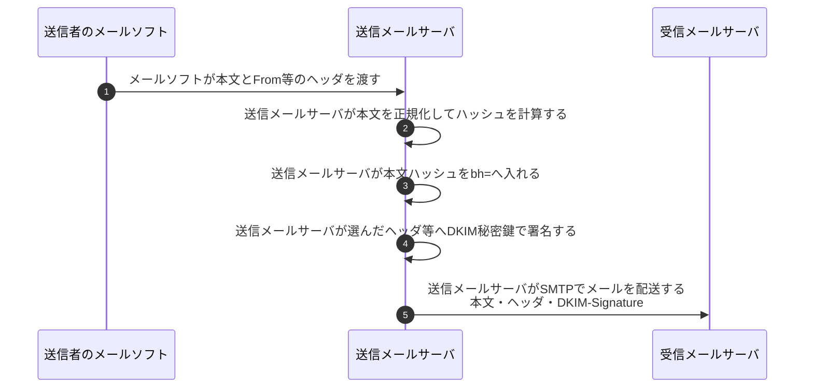
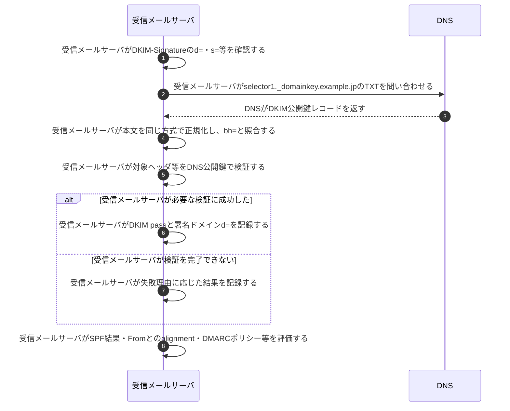

# DKIMの署名と検証

## 前提と登場人物

**送信メールサーバが署名し、受信メールサーバが検証する。** `example.jp`の管理者は、送信サーバにDKIM秘密鍵を設定し、対応する公開鍵を`selector1._domainkey.example.jp`のDNS TXTで公開済みとする。図のDNSは名前解決の仕組みをまとめたもので、再帰問い合わせの各段階は省略する。

`d=example.jp`は署名ドメイン、`s=selector1`は同一ドメイン内の鍵を選ぶ名前である。DMARCは別の通信相手ではなく、受信側が後で行う評価である。

## 全体像

図の内容を文字で読む

<!-- overview:start -->
要点: 送信メールサーバが署名し、受信メールサーバが検証する。

補足: 本文ハッシュがbh=、署名がb=。秘密鍵はDNSにもメールにも載せない。

| 段階 | 種類 | 主体 | 相手 | 内容 |
|---|---|---|---|---|
| 署名して配送 | 内部 | 送信メールサーバ | — | 本文を正規化してbh=を作り、対象ヘッダ等へDKIM秘密鍵で署名する。 |
| 署名して配送 | 送信 | 送信メールサーバ | 受信メールサーバ | 本文・ヘッダ・DKIM-SignatureをSMTPで配送する。 |
| 受信側の検証 | 交換 | 受信メールサーバ | DNS | d=とs=から公開鍵の場所を決め、TXTレコードを取得する。 |
| 受信側の検証 | 確認 | 受信メールサーバ | — | 受信本文を同じ方式で正規化・ハッシュ化し、bh=と照合する。 |
| 受信側の検証 | 確認 | 受信メールサーバ | — | 対象ヘッダ等とDNSの公開鍵を使い、署名b=を検証する。 |
| 結果の利用 | 内部 | 受信メールサーバ | — | DKIM結果を記録する。DMARCではFromとのalignment等も別途評価する。 |
<!-- overview:end -->

詳しい手順・分岐を開く（Mermaid）

## 1. 送信メールサーバがDKIM-Signatureを付ける

セキスペ対策では、DKIM-Signatureの全タグや署名計算時の細かな文字列処理を暗記するより、**本文ハッシュと選択ヘッダを署名で保護し、`d=`と`s=`からDNS公開鍵を取得して検証する**流れを押さえる。

## 2. 受信メールサーバが本文ハッシュと署名を検証する

## 処理後に残るもの

| 主体 | 保持するもの | 公開・送信しないもの |
|---|---|---|
| 送信メールサーバ | DKIM秘密鍵、署名設定 | 秘密鍵をDNSやメールへ載せない |
| DNS | selectorごとの公開鍵レコード | DKIM秘密鍵 |
| 受信メールサーバ | 受信メール、DKIM検証結果、認証済み署名ドメイン | 送信側の秘密鍵は不要 |

## 注意点

DKIM passは、署名対象の完全性と署名ドメインが署名に関与したことを確認するもので、表示上の差出人本人やメール内容の安全性を保証しない。DMARCでは`d=`とヘッダFromのドメインのalignmentも確認する。

`d=`（署名ドメイン）、`s=`（selector）、`bh=`（本文ハッシュ）、`b=`（署名）の役割を優先して覚え、その他の任意タグや部分署名などの仕様詳細は、問題文で要求された場合に確認する。

## 参照資料

- [RFC 6376 §3.5・§5・§6：DKIMの署名対象と検証](https://www.rfc-editor.org/rfc/rfc6376.html)
- [RFC 7489 §3.1：DMARC identifier alignment](https://www.rfc-editor.org/rfc/rfc7489.html)
