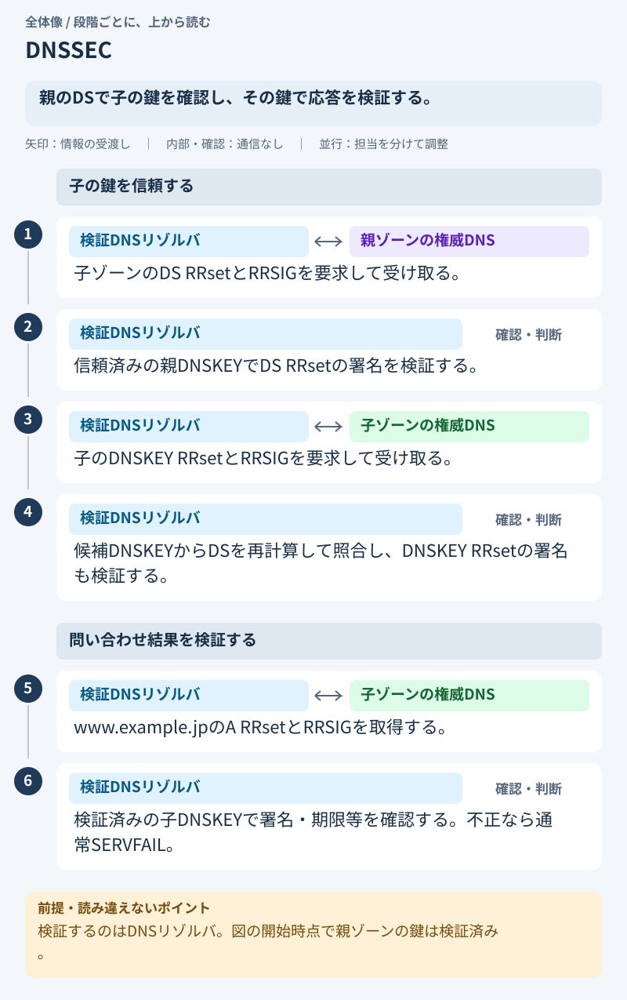
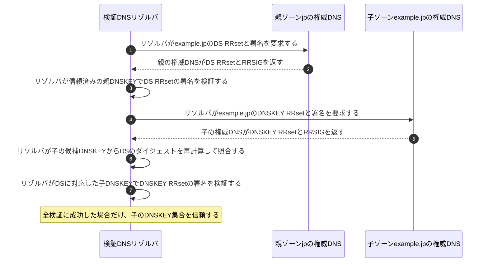
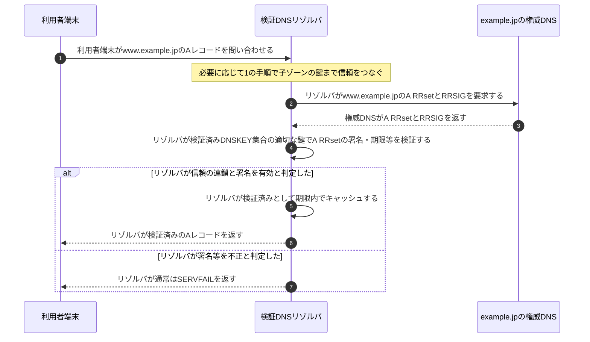

# DNSSEC

## 前提と登場人物

**署名を検証するのは検証機能付きDNSリゾルバ**であり、利用者本人や権威DNSサーバではない。権威DNSはゾーンの署名済みレコードを提供する役割である。リゾルバはルートの信頼アンカーを安全な方法で事前保持している。

DNSSECはDNS応答の真正性・完全性を確認する仕組みで、DNS通信の暗号化ではない。以下は署名済みゾーンへ信頼をつなぐ基本例で、キャッシュや否定応答の詳細は省略する。

## 全体像

図の内容を文字で読む

<!-- overview:start -->
要点: 親のDSで子の鍵を確認し、その鍵で応答を検証する。

補足: 検証するのはDNSリゾルバ。図の開始時点で親ゾーンの鍵は検証済み。

| 段階 | 種類 | 主体 | 相手 | 内容 |
|---|---|---|---|---|
| 子の鍵を信頼する | 交換 | 検証DNSリゾルバ | 親ゾーンの権威DNS | 子ゾーンのDS RRsetとRRSIGを要求して受け取る。 |
| 子の鍵を信頼する | 確認 | 検証DNSリゾルバ | — | 信頼済みの親DNSKEYでDS RRsetの署名を検証する。 |
| 子の鍵を信頼する | 交換 | 検証DNSリゾルバ | 子ゾーンの権威DNS | 子のDNSKEY RRsetとRRSIGを要求して受け取る。 |
| 子の鍵を信頼する | 確認 | 検証DNSリゾルバ | — | 候補DNSKEYからDSを再計算して照合し、DNSKEY RRsetの署名も検証する。 |
| 問い合わせ結果を検証する | 交換 | 検証DNSリゾルバ | 子ゾーンの権威DNS | www.example.jpのA RRsetとRRSIGを取得する。 |
| 問い合わせ結果を検証する | 確認 | 検証DNSリゾルバ | — | 検証済みの子DNSKEYで署名・期限等を確認する。不正なら通常SERVFAIL。 |
<!-- overview:end -->

詳しい手順・分岐を開く（Mermaid）

## 1. リゾルバが親から子へ信頼をつなぐ

ルートのDNSKEY RRsetを信頼アンカーで検証し、その鍵集合で`.jp`のDSを検証する。同じ手順を繰り返して`example.jp`へ進む。次の図は、**リゾルバが既に`.jp`のDNSKEY RRsetを検証済み**の段階を取り出している。

DSのダイジェストはDNSKEYだけの単純な文字列ハッシュではなく、所有者名とDNSKEY RDATAを所定の形式で計算する。DSは子の特定の鍵を親へ結び付け、RRSIGはRRsetへの署名を表す。

## 2. リゾルバが問い合わせ対象のレコードを検証する

## 処理後に残るもの

| 主体 | 保持するもの |
|---|---|
| 検証DNSリゾルバ | 信頼アンカー、検証結果、期限内のDNSKEY・DS・RRset等のキャッシュ |
| ゾーンの署名者／権威DNS基盤 | 署名用秘密鍵を保護して管理し、公開DNSKEY・DS・RRSIG等を提供する。秘密鍵を問い合わせへの応答に含めない |
| 利用者端末 | リゾルバから受け取った応答。端末とリゾルバ間の信頼・通信保護も別途必要 |

## 注意点

検証の入力は**RRset本体・RRSIG・公開DNSKEY**であり、RRSIGだけを処理するわけではない。典型的にはKSKがDNSKEY RRsetへ、ZSKがA等のRRsetへ署名するが、鍵の分け方は構成による。

署名があるはずなのに検証できない`bogus`と、署名なしの委任であることを正当に確認した`insecure`は別である。後者まで必ずSERVFAILにするわけではない。図の失敗分岐は検証を要求する通常の問い合わせを想定し、検証を無効にする要求等は省略した。

## 参照資料

- [RFC 4035 §5：認証済み鍵、RRset、応答の検証](https://www.rfc-editor.org/rfc/rfc4035.html)
- [RFC 4034 §5.1.4：DSダイジェストの計算対象](https://www.rfc-editor.org/rfc/rfc4034.html)
