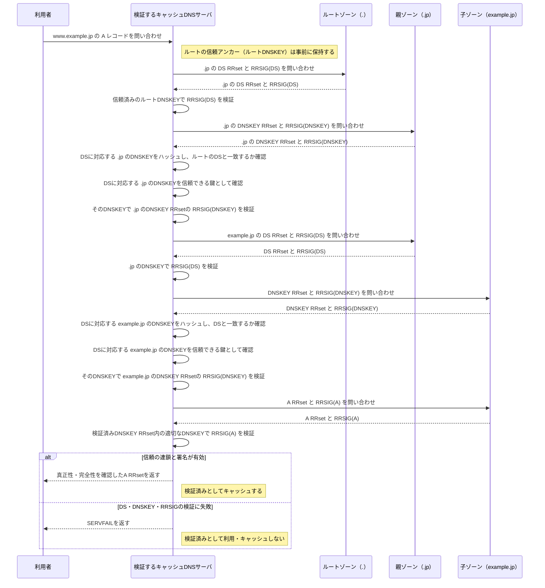

# DNSSEC

## DNSSECで確認するもの

- `RRSIG`はDNSレコード群（RRset）に付く電子署名、`DNSKEY`はその署名を検証する公開鍵である。
- `DS`は親ゾーンに置かれる、子ゾーンの**特定のDNSKEY**から計算したダイジェスト（ハッシュ値）を含むレコードである。親ゾーンのDNSKEYで`RRSIG(DS)`を検証してから、DSに対応する子ゾーンDNSKEYのハッシュとDSを照合する。これにより、そのDNSKEYが親ゾーンから信頼される鍵だと確認できる。
- `DS`と`DNSKEY`の照合によって、親ゾーンから子ゾーンのDNSKEYへ信頼をつなぐ。電子署名を検証する組合せは`DNSKEY`と`RRSIG`であり、DSに対応するDNSKEYを起点としてDNSKEY RRsetを検証し、その検証済みDNSKEY RRsetに含まれる適切なDNSKEYでA RRsetなどの`RRSIG`を検証する。典型的にはKSKがDNSKEY RRsetへ、ZSKがA・AAAA・MX・TXTなどのRRsetへ署名する。
- DNSSECは、問い合わせや応答を暗号化する仕組みではない。DNS応答が正当なゾーンの秘密鍵によって署名され、途中で改ざんされていないことを検証する仕組みである。
