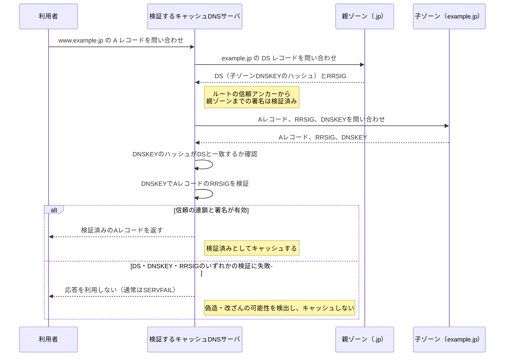

# DNSキャッシュポイズニングとDNSSEC

## DNSSECで確認するもの

- `RRSIG`はDNSレコード群（RRset）に付く電子署名、`DNSKEY`はその署名を検証する公開鍵である。
- `DS`は親ゾーンに置く「子ゾーンのDNSKEYのハッシュ」である。親から子へたどれるようにすることで、ルートを起点とした信頼の連鎖を作る。
- DNSSECは、問い合わせや応答を暗号化する仕組みではない。DNS応答が正しいゾーンにより作られ、途中で改ざんされていないことを検証する仕組みである。
