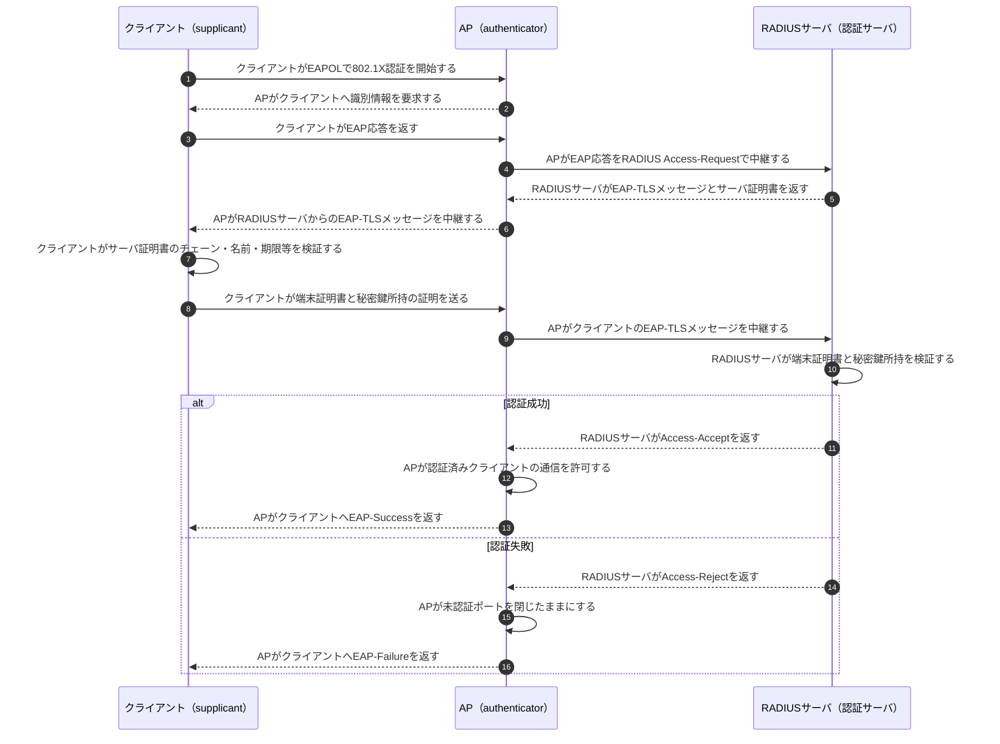

# EAP-TLSと802.1X認証

## 前提と登場人物

証明書で端末を認証する802.1X対応の無線LANを想定する。クライアントはsupplicant、アクセスポイント（AP）はauthenticator、RADIUSサーバは認証サーバである。クライアントには端末証明書と対応する秘密鍵、RADIUSサーバにはサーバ証明書と秘密鍵が事前に設定され、双方は必要なCA証明書を信頼している。証明書の発行・配布手順と、PEAPなどEAP-TLS以外の方式は省略する。

## 全体像

図の内容を文字で読む

<!-- overview:start -->
要点: APは認証を中継し、RADIUSサーバが証明書を検証して結果を返す。

補足: CAは証明書の発行者であり、通常の接続認証時にRADIUSサーバの代わりとして判定する主体ではない。

| 段階 | 種類 | 主体 | 相手 | 内容 |
|---|---|---|---|---|
| 認証開始 | 交換 | クライアント | AP | クライアントがEAPOLで802.1X認証を開始し、APが識別情報を要求する。 |
| 認証中継 | 送信 | AP | RADIUSサーバ | APがクライアントのEAPメッセージをRADIUS Access-Requestで中継する。 |
| サーバ確認 | 送信 | RADIUSサーバ | クライアント | RADIUSサーバがAP経由でサーバ証明書を提示し、クライアントが信頼性と接続先を検証する。 |
| 端末確認 | 送信 | クライアント | RADIUSサーバ | クライアントがAP経由で端末証明書と秘密鍵所持の証明を提示する。秘密鍵は送らない。 |
| 証明書検証 | 確認 | RADIUSサーバ | — | RADIUSサーバが端末証明書のチェーン・期限・失効・用途と秘密鍵所持を検証する。 |
| 結果通知 | 送信 | RADIUSサーバ | AP | RADIUSサーバがAccess-AcceptまたはAccess-Rejectを返す。 |
| 接続制御 | 確認 | AP | — | APが成功時だけ通信を許可し、失敗時は未認証ポートを閉じたままにする。 |
<!-- overview:end -->

詳しい手順・分岐を開く（Mermaid）

## 処理後に残るもの

| 主体 | 保持するもの |
|---|---|
| クライアント | 端末証明書、対応する秘密鍵、信頼するCA証明書。秘密鍵は外部へ送らない |
| AP | 認証結果、許可・拒否状態、構成に応じて無線通信を保護するための鍵情報 |
| RADIUSサーバ | サーバ証明書と秘密鍵、信頼するCA証明書、認証ポリシー、認証結果とログ |
| CA | 証明書の発行・失効情報とCA秘密鍵。通常の接続認証ごとに判定を行う主体ではない |

## 注意点

RADIUSサーバは認証局ではない。CAが発行した証明書を信頼設定とポリシーに基づいて検証し、認証結果をAPへ返す。APも通常は端末証明書を直接検証せず、EAPメッセージを中継してRADIUSの結果に従う。

証明書を提示するだけでは秘密鍵の所持を確認できないため、EAP-TLSのTLS処理で対応する秘密鍵を持つことを証明する。クライアントはRADIUS側のサーバ証明書も検証し、偽の認証サーバへ接続しないようにする。実際のRADIUS経路の保護や無線暗号鍵の導出・配送は構成と使用プロトコルに依存する。

## 参照資料

- [RFC 5216：The EAP-TLS Authentication Protocol](https://www.rfc-editor.org/rfc/rfc5216.html)
- [RFC 3748：Extensible Authentication Protocol](https://www.rfc-editor.org/rfc/rfc3748.html)
- [RFC 2865：Remote Authentication Dial In User Service](https://www.rfc-editor.org/rfc/rfc2865.html)
- [IEEE 802.1X-2020](https://standards.ieee.org/standard/802_1X-2020.html)
