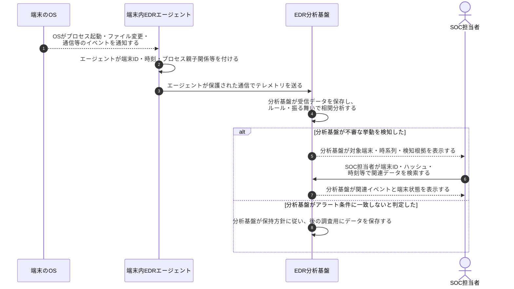
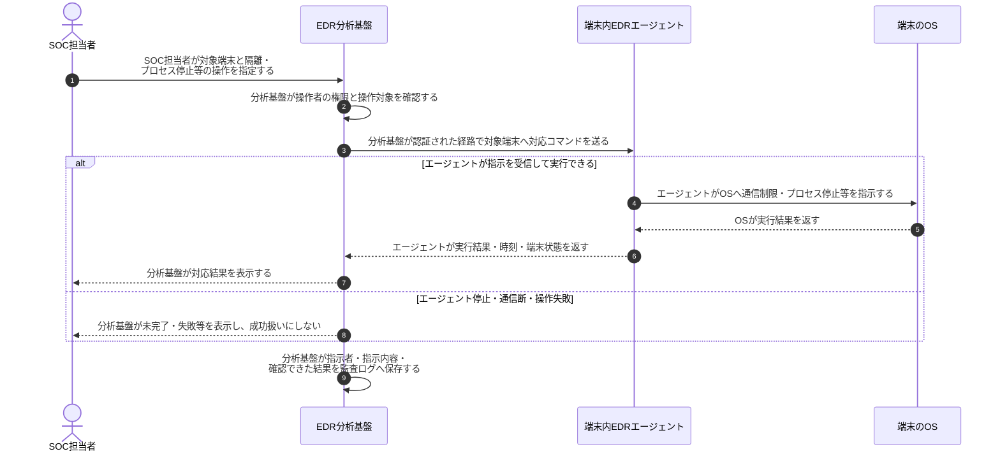

# EDRテレメトリの収集・分析・対応

## 前提と登場人物

**観測データは端末から分析基盤へ、対応指示は分析基盤から端末へ**流れる。端末内のOS、端末内のEDRエージェント、端末外の分析・管理基盤、SOC担当者を区別する。以下は基盤側で分析し、人が対応を承認する構成例で、製品によって端末側の検知・自動対応もある。

エージェントは収集・制御を行うソフト、テレメトリは送られる観測データである。収集・分析・調査・対応までを含む仕組み全体をEDRと呼ぶ。

## 全体像

図の内容を文字で読む

<!-- overview:start -->
要点: 観測データは基盤へ。対応指示は端末へ。

補足: 基盤側で分析し、人が対応を承認する例。コマンド送信と隔離成功は別。

| 段階 | 種類 | 主体 | 相手 | 内容 |
|---|---|---|---|---|
| 収集・分析 | 送信 | 端末OS | EDRエージェント | プロセス起動・ファイル変更・通信イベント等を通知する。 |
| 収集・分析 | 送信 | EDRエージェント | EDR分析基盤 | 端末ID・時刻等を付けたテレメトリを、保護された経路で送る。 |
| 収集・分析 | 送信 | EDR分析基盤 | SOC担当者 | 受信データを保存・分析し、不審な挙動と検知根拠を表示する。 |
| 対応指示 | 送信 | SOC担当者 | EDR分析基盤 | 対象端末と、隔離・プロセス停止等の操作を指定する。 |
| 対応指示 | 送信 | EDR分析基盤 | EDRエージェント | 操作者の権限を確認したうえで、対象端末にコマンドを送る。 |
| 実行・結果確認 | 交換 | EDRエージェント | 端末OS | 通信制限等の操作を要求し、実行結果を確認する。 |
| 実行・結果確認 | 送信 | EDRエージェント | EDR分析基盤 | 実行結果・時刻・状態を報告する。基盤はSOCへ結果を表示する。 |
<!-- overview:end -->

詳しい手順・分岐を開く（Mermaid）

## 1. EDRが観測データを収集・分析する

## 2. SOC担当者の指示をエージェントが実行する

自動対応では、SOC担当者の指示に相当する判断を事前承認ポリシーが担う。人の承認を必要とする操作と分ける。端末隔離後に管理通信を維持するか等の詳細は製品・設定に依存する。

## 処理後に残るもの

| 主体 | 保持するもの・変化する状態 |
|---|---|
| 端末内エージェント | 収集設定、端末ID、一時バッファ、対応状態 |
| 端末のOS | プロセス・ファイル・通信状態。成功した対応によって変化する |
| EDR分析基盤 | テレメトリ、アラート、検索・調査結果、対応監査ログ |
| SOC担当者 | 調査判断・インシデント記録。基盤のデータを権限内で参照する |

## 注意点

コマンドを送っただけでは隔離成功とは限らず、実行結果を確認する。エージェント停止や通信断、未収集のイベント、保存期間切れは調査の制約になる。テレメトリにはコマンドライン・利用者名等の機微情報も含まれ得るため、閲覧権限・保存期間・暗号化・監査を設定する。

EDRだけでクラウドやネットワーク全体の証拠がそろうわけではない。SIEM・NDR・クラウド監査ログ等で補い、認証情報の無効化や侵入経路修正、復元は[復旧手順](ランサムウェア初動から復旧.md)で扱う。

## 参照資料

- [Microsoft：Endpoint detection and response capabilities](https://learn.microsoft.com/en-us/defender-endpoint/overview-endpoint-detection-response)
- [Microsoft：Respond to threats on devices](https://learn.microsoft.com/en-us/defender-endpoint/respond-machine-alerts)
