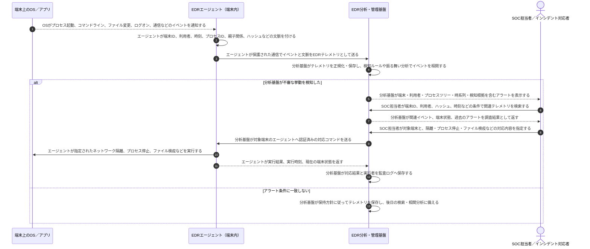

# EDRテレメトリの収集・分析・対応

EDRでは、**観測データは端末から分析基盤へ送り、対応指示は分析基盤から端末へ返す**。エージェントとテレメトリは構成要素であり、収集・分析・調査・対応までを含む仕組み全体がEDRである。

## 収集から対応まで

自動対応を設定している場合は、SOC担当者による指示の代わりに、分析基盤が事前承認されたポリシーに基づいて対応コマンドを送る。誤検知による業務停止を避けるため、自動化する操作と人の承認を必要とする操作を分ける。

## 処理後に誰が何を保持するか

| 主体 | 主に保持するもの | 主な役割・注意点 |
|---|---|---|
| 端末上のEDRエージェント | 収集設定、端末識別情報、送信前の一時バッファ、直近の対応状態など | イベントを収集して送信し、分析基盤から届いた対応を端末上で実行する |
| EDR分析・管理基盤 | 受信したテレメトリ、端末・利用者との対応、検知ルール、アラート、調査結果、対応の監査ログ | 複数イベント・複数端末を相関し、検知・検索・対応指示を行う |
| SOC担当者／インシデント対応者 | 調査判断、インシデント記録、対応方針 | 管理コンソールを通じて基盤内のデータを参照し、必要な対応を決める |
| 端末上のOS／アプリ | 実行中のプロセス、ファイル、設定、通信状態など | 監視される対象であり、隔離や停止などの対応によって状態が変わる |

テレメトリには利用者名、コマンドライン、ファイルパス、通信先などの機微情報が含まれ得る。分析基盤ではアクセス制御、暗号化、保存期間、監査ログを設定し、調査に必要な範囲を超えて利用できないようにする。

## EDRだけでは埋められない範囲

- エージェントが停止・改ざんされた端末や、ネットワークから切断された端末では、テレメトリ送信や遠隔対応が遅延・失敗することがある。
- 収集していないイベントや保存期間を過ぎたイベントは、後から分析できない。
- EDRが主に観測するのはエンドポイントである。ネットワーク機器、クラウド制御プレーン、SaaSなどの記録は、SIEM、NDR、クラウド監査ログなどで補う。
- 端末隔離やマルウェア除去は復旧の一部であり、漏えいした認証情報の無効化、影響範囲調査、脆弱性修正、バックアップからの復元などは別途必要になる。

## 参照資料

- [Endpoint Detection and Response — NIST CSRC Glossary](https://csrc.nist.gov/glossary/term/endpoint_detection_and_response)
- [Continuous Diagnostics and Mitigation Technical Capabilities — CISA](https://www.cisa.gov/sites/default/files/publications/cdm-technical-capabilities-vol2-v24.pdf)
