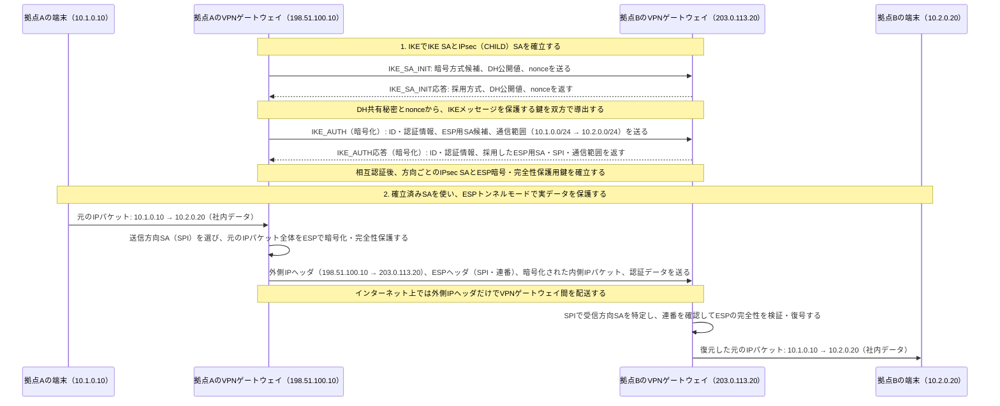

# IPsecトンネルモードとIKE

拠点間VPNでは、まずVPNゲートウェイ同士が**IKE**で相互認証し、暗号方式・鍵・通信範囲を定めたSA（Security Association）を確立する。その後、確立済みのSAを使って**ESP**が元のIPパケット全体を保護し、外側IPヘッダで相手のVPNゲートウェイまで届ける。

## 覚えるポイント

- **SA**は、暗号方式・鍵・SPI・通信方向・保護対象の通信範囲（Traffic Selector）などをまとめた「この通信をどう保護するか」の合意である。通常、送信方向と受信方向で別々のSAを持つ。
- **IKE**は、DH鍵共有・相互認証・暗号方式の交渉を行い、IKE自身を保護するIKE SAと、ESP通信に使うIPsec SA（IKEv2ではCHILD SA）を確立する。実データを包むのはIKEではなくESPである。
- **ESPトンネルモード**では、元のIPヘッダを含むIPパケット全体が内側の保護対象になる。外側IPヘッダの宛先は本来の通信先端末ではなく、相手側VPNゲートウェイである。
- 受信ゲートウェイはESPヘッダのSPIでSAを選び、改ざん・再送を確認してから復号する。検証に失敗したパケットは内側ネットワークへ転送しない。
