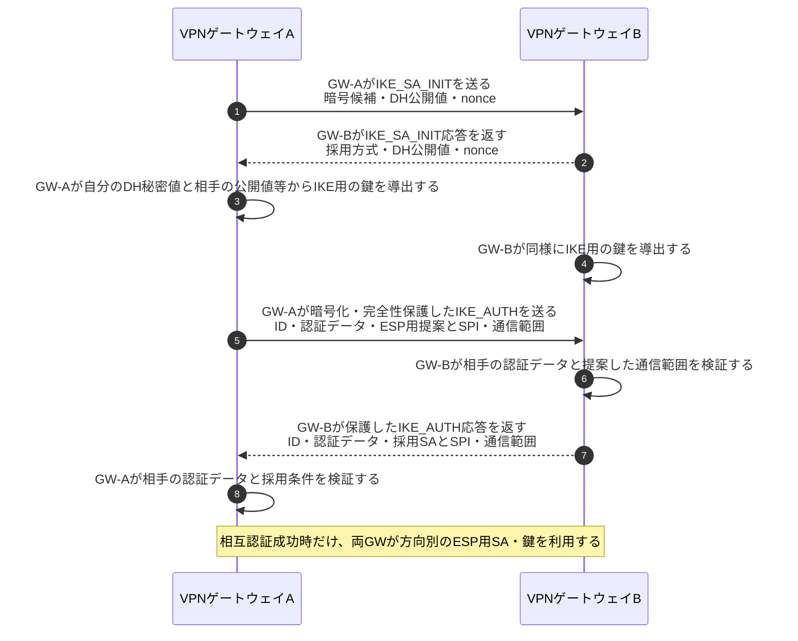
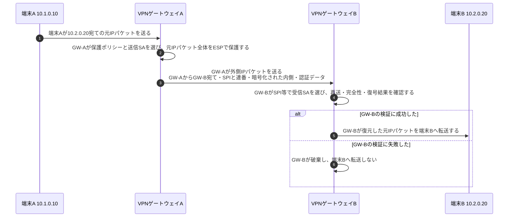

# IPsecトンネルモードとIKE

## 前提と登場人物

**IKEv2で鍵・相手・通信範囲を確立し、ESPで実データを保護する**拠点間VPNの例である。端末AとBの間を、VPNゲートウェイAとBが中継する。以下は通常のIKE_AUTHによる相互認証とESPの暗号化・完全性保護を使い、EAP、NAT越え、再鍵交換は省略する。

SAは暗号方式・鍵・SPI等をまとめた通信の取り決めである。IKE SAはIKEの制御通信を保護し、CHILD SAがESP用の方向別SAを用意する。

## 全体像

図の内容を文字で読む

<!-- overview:start -->
要点: IKEは通信の準備。ESPは実データの保護。

補足: 拠点間VPNの例。相互認証が成功してからESPを使い、検証失敗時は転送しない。

| 段階 | 種類 | 主体 | 相手 | 内容 |
|---|---|---|---|---|
| 準備：IKEv2 | 交換 | VPNゲートウェイA | VPNゲートウェイB | IKE_SA_INITで方式・DH公開値・nonceを交換する。 |
| 準備：IKEv2 | 内部 | 両VPNゲートウェイ | — | 各自のDH秘密値と相手の公開値等からIKE用の鍵を導出する。 |
| 準備：IKEv2 | 交換 | VPNゲートウェイA | VPNゲートウェイB | 保護したIKE_AUTHで相互認証し、方向別ESP SA・鍵・通信範囲を確立する。 |
| 実データ：ESP | 送信 | 端末A | VPNゲートウェイA | 端末B宛ての元IPパケットを送る。 |
| 実データ：ESP | 送信 | VPNゲートウェイA | VPNゲートウェイB | 元IPパケット全体をESPで保護し、GW宛ての外側IPヘッダで運ぶ。 |
| 実データ：ESP | 確認 | VPNゲートウェイB | — | SPIでSAを選び、再送・完全性・復号結果を確認する。 |
| 実データ：ESP | 送信 | VPNゲートウェイB | 端末B | 検証成功時だけ、復元した元IPパケットを転送する。 |
<!-- overview:end -->

詳しい手順・分岐を開く（Mermaid）

## 1. VPNゲートウェイ同士がIKEで準備する

証明書認証なら相手証明書と署名、事前共有鍵認証ならその鍵に基づく認証データを検証する。秘密鍵・事前共有鍵・DH共有秘密をそのまま送るわけではない。認証や条件の確認に失敗したら、ESP通信へ進まない。

## 2. VPNゲートウェイがESPで元のIPパケットを運ぶ

インターネットのルータは外側IPヘッダのGW宛先で配送する。ESPトンネルでは元のIPヘッダも内側で保護されるが、外側IPヘッダ自体がESPで暗号化されるわけではない。

## 処理後に残るもの

| 主体 | 保持するもの・見える範囲 |
|---|---|
| 両VPNゲートウェイ | 認証設定、IKE SA、方向別ESP SA、鍵、SPI、送受信連番等 |
| 端末A・B | 本来の端末間通信。拠点間VPNだけなら通常はGWのIPsec鍵を持たない |
| 中継ルータ | 外側IPヘッダ等。暗号化された内側IPパケットは読めない |

## 注意点

SPIは鍵そのものではなく、受信側がSAを選ぶための識別子である。ESP SAは方向別なので、A→BとB→Aを一つの共通状態として描かない。拠点内区間までこのVPNだけで暗号化されるとは限らず、必要ならTLS等も使う。

## 参照資料

- [RFC 7296 §1.2・§2.15：IKEv2と認証](https://www.rfc-editor.org/rfc/rfc7296.html)
- [RFC 4303 §2・§3：ESPトンネルと受信処理](https://www.rfc-editor.org/rfc/rfc4303.html)
