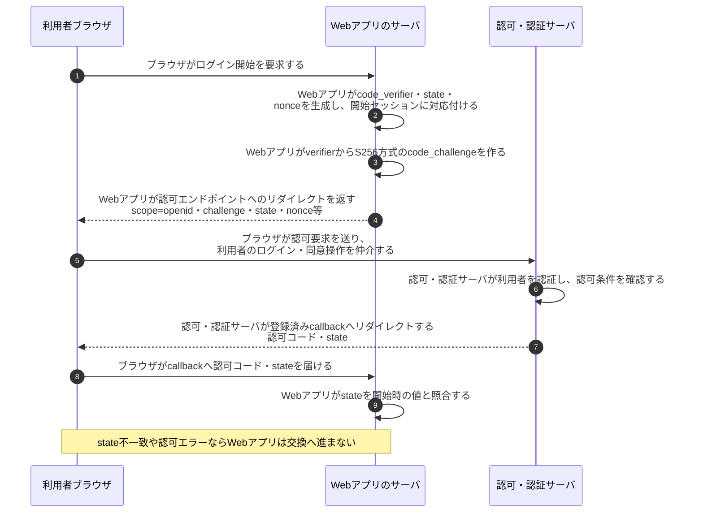
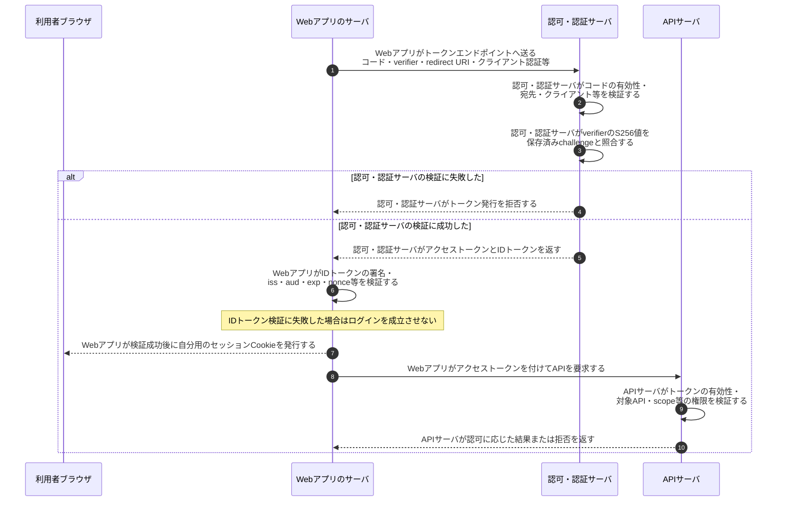

# OAuth 2.0 / OIDCの認可コードとPKCE

## 前提と登場人物

この図は**サーバーサイドWebアプリ**をクライアントとする、OIDCの認可コードフロー＋PKCEの例である。ブラウザ、Webアプリのサーバ、認可・認証サーバ、APIサーバを区別する。HTTPSを使い、redirect URI等は登録済みとする。

利用者は認可・認証サーバの画面でログインする。Webアプリのサーバは認可コードを受け取り、サーバ間通信でトークンへ交換する。SPAやモバイルアプリではクライアントとverifierの保持場所が変わるため、この図のサーバをそのまま当てはめない。

## 1. Webアプリが認可要求を作り、ブラウザがコードを届ける

## 2. Webアプリがコードをトークンへ交換し、APIを使う

## 処理後に残るもの

| 主体 | 保持するもの | 渡さないもの・寿命 |
|---|---|---|
| Webアプリのサーバ | アクセストークン、検証済み利用者情報、Webアプリ用セッション | verifier・state・nonceは認証試行に結び付けた一時情報。verifierは認可要求へ載せない |
| ブラウザ | Webアプリ用Cookie、認可サーバ用Cookie等をそれぞれの条件で保持 | この構成ではAPI用トークンをブラウザへ渡す必要はない |
| 認可・認証サーバ | 利用者・クライアント登録、コードとchallengeの対応、発行状態 | 一度使ったコードを再利用させない |
| APIサーバ | トークン検証に必要な設定・鍵または照会手段 | Webアプリのverifierは不要 |

## 注意点

PKCEは`BASE64URL(SHA256(code_verifier))`をchallengeとして登録し、コード交換時に照合する。コードを横取りしてもverifierを持たない相手の交換を防ぐ。`state`は開始したブラウザセッションとの対応、OIDCの`nonce`はIDトークンと認証要求との対応に使う。

OAuth 2.0はAPI利用の認可、OIDCはIDトークンによる認証連携である。**IDトークンをAPI用アクセストークンの代わりに送らない。** OAuthだけならIDトークンは発行されない。リフレッシュトークンやトークン更新はこの図では省略した。

## 参照資料

- [RFC 7636 §4：PKCE](https://www.rfc-editor.org/rfc/rfc7636.html)
- [OpenID Connect Core §3.1：認可コードフローとIDトークン検証](https://openid.net/specs/openid-connect-core-1_0.html)
