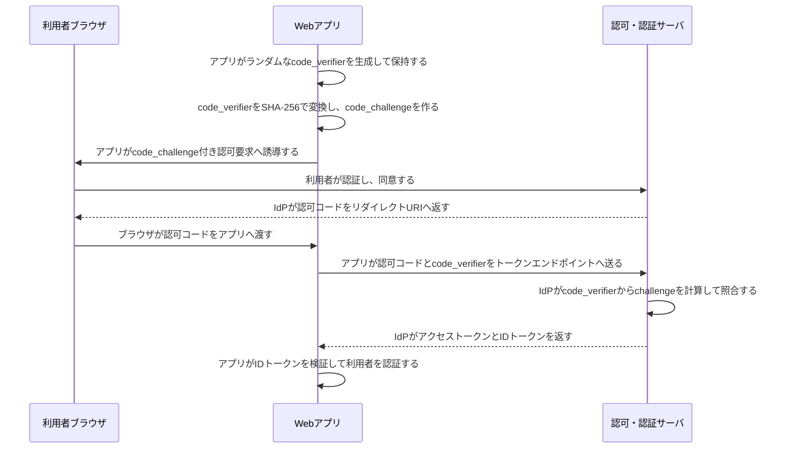

# OAuth 2.0 / OIDCの認可コードとPKCE

- OAuth 2.0は、クライアントへAPIアクセス権限を委譲する認可の仕組みである。
- OIDCはOAuth 2.0の上でIDトークンを使い、利用者が誰かをクライアントが確認する認証を提供する。
- PKCEは、公開クライアントから認可コードが横取りされても、最初に作った`code_verifier`を持たない攻撃者がトークンへ交換できないようにする。
- `code_verifier`はクライアントが最初に生成して保持する秘密のランダム値である。認可要求にはその変換値である`code_challenge`だけを送り、トークン交換時に元の`code_verifier`を送って照合する。
