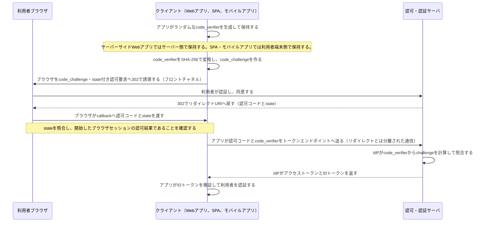

# OAuth 2.0 / OIDCの認可コードとPKCE

- OAuth 2.0は、クライアントへAPIアクセス権限を委譲する認可の仕組みである。
- OIDCはOAuth 2.0の上でIDトークンを使い、利用者が誰かをクライアントが確認する認証を提供する。
- PKCEは、公開クライアントから認可コードが横取りされても、最初に作った`code_verifier`を持たない攻撃者がトークンへ交換できないようにする。
- `code_verifier`はクライアントが最初に生成して保持する秘密のランダム値である。認可要求にはその変換値である`code_challenge`だけを送り、トークン交換時に元の`code_verifier`を送って照合する。
- `code_verifier`の保持場所はクライアントの構成に従う。サーバーサイドWebアプリではWebアプリのサーバー側が保持し、SPAやモバイルアプリでは利用者端末上のアプリが保持する。どちらも、認可コードを受け取ってトークン交換を行うクライアントだけが値を保持することが重要である。
- Authorization Endpointは、利用者のログイン・MFA・同意を画面上で扱うため、ブラウザを介すフロントチャネルとして設計されている。認証・同意後、IdPはブラウザへ302を返し、ブラウザがリダイレクトURIへ認可コードを届ける。アクセストークンはこのリダイレクトへ載せず、認可コードの交換で取得する。
