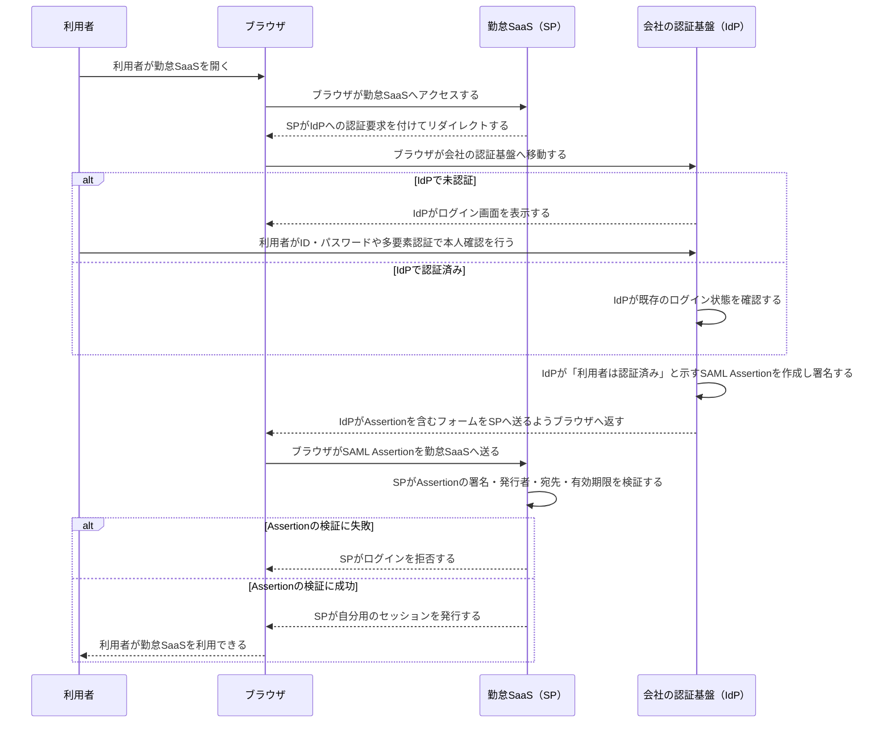

# SAMLによるSSO

SAMLは、**会社のログイン窓口（IdP）で一度本人確認すると、連携先サービス（SP）へ個別のパスワード入力なしで入れるようにする仕組み**です。

たとえば、社員が社内ポータルから勤怠SaaSや経費精算SaaSを使う場面で利用されます。各SaaSがパスワードを個別に管理する代わりに、IdPが「この人は認証済み」と保証します。

## 4つだけ覚える

- **IdP（Identity Provider）**: 会社の認証基盤。利用者本人を認証し、認証済みだと保証する。
- **SP（Service Provider）**: 勤怠・経費精算などの利用先サービス。IdPの保証を検証して利用を許可する。
- **SAML Assertion**: 「この利用者は認証済み」「誰であるか」などを表す、IdP署名付きの情報。
- **SSO（Single Sign-On）**: 一度のログインで複数サービスを使える状態。

## 間違えやすい点

- SAMLで認証するのは**IdP**、Assertionを受け取り検証するのは**SP**です。
- Assertionはブラウザを経由してSPへ届きますが、SPはそのまま信用せず、署名・発行者・宛先・有効期限を検証します。
- SAMLは主に組織向けのWeb SSOでよく使われます。OAuth 2.0は主に「APIへ何を許可するか」の認可、OIDCはOAuth 2.0上の認証連携であり、同じものではありません。
