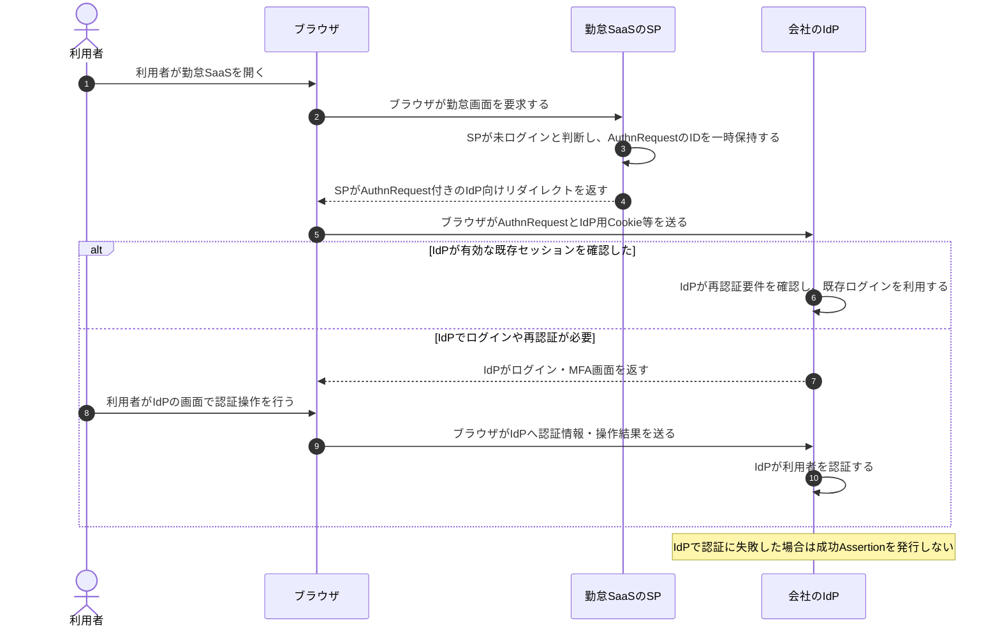
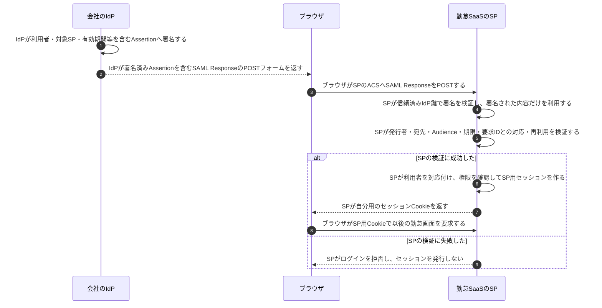

# SAMLによるSSO

## 前提と登場人物

**利用者を認証するのはIdP、Assertionを検証して自分用セッションを作るのはSP**である。ここでは会社のIdPと勤怠SaaSのSPが、署名検証鍵・識別子・返送先等を設定済みとする。

以下はSP起点のWeb SSOで、認証要求はリダイレクト、SAML ResponseはHTTPSのフォームPOSTでブラウザが運ぶ構成例である。IdP起点SSOや別のbindingは省略する。

## 1. SPがブラウザをIdPへ案内する

## 2. SPがAssertionを検証してログイン状態を作る

ACSはSPがSAML Responseを受け取る窓口である。Response全体への署名等を使う構成もあるが、いずれも署名検証済みの要素と実際に利用する利用者情報を一致させる必要がある。

## 処理後に残るもの

| 主体 | 保持するもの | 相手へ渡さないもの |
|---|---|---|
| IdP | 署名秘密鍵、利用者情報、IdP用ログイン状態 | IdPの署名秘密鍵、利用者のパスワードをSPへ渡さない |
| SP | 信頼済みIdPの検証鍵・設定、SP用セッション、再送検出等の状態 | IdPの秘密鍵は不要 |
| ブラウザ | IdP用CookieとSP用Cookieを別々に保持。一時的にSAML Responseを仲介 | IdPのCookieをSP用Cookieとして流用しない |

## 注意点

SSOは、一度のログインを別の連携サービスでも利用できることを指す。別SPを開いた際も、そのSP向けのAssertion検証とセッション発行は行う。ブラウザを通ったAssertionを無条件に信用したり、IdPの認証成功だけでSPの全機能を許可したりしない。

## 参照資料

- [OWASP：SAML Security Cheat Sheet（Redirect/POST、署名・要求対応・再送検証）](https://cheatsheetseries.owasp.org/cheatsheets/SAML_Security_Cheat_Sheet.html)
