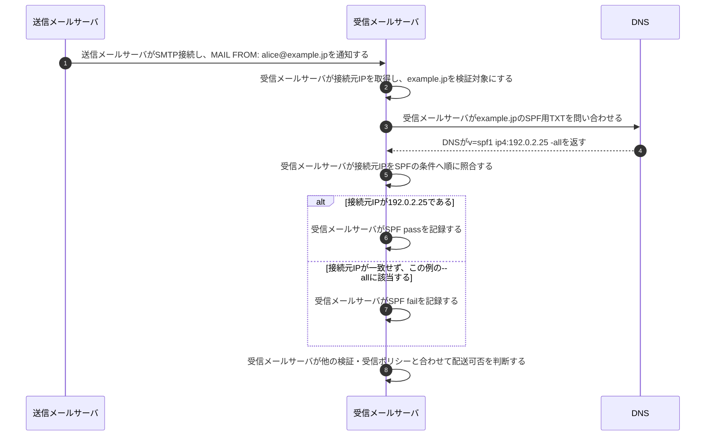

# SPF検証

## 前提と登場人物

**受信メールサーバが、実際のSMTP接続元IPを、MAIL FROMのドメインのSPFポリシーと照合する。** 図ではMAIL FROMが`alice@example.jp`、公開レコードが`v=spf1 ip4:192.0.2.25 -all`である例を使う。DNSは再帰問い合わせを含む名前解決の仕組みをまとめている。

## 全体像

図の内容を文字で読む

<!-- overview:start -->
要点: 受信側が、接続元IPと送信ドメインの許可条件を照合。

補足: 対象はMAIL FROMのドメイン。本文改ざんや表示上の差出人本人を確認する仕組みではない。

| 段階 | 種類 | 主体 | 相手 | 内容 |
|---|---|---|---|---|
| 接続を観測 | 送信 | 送信メールサーバ | 受信メールサーバ | SMTP接続し、MAIL FROM: alice@example.jpを通知する。 |
| 接続を観測 | 内部 | 受信メールサーバ | — | 実際の接続元IPを取得し、example.jpを検証対象にする。 |
| 許可条件を取得 | 交換 | 受信メールサーバ | DNS | example.jpのSPF用TXTを問い合わせ、送信経路のポリシーを受け取る。 |
| 受信側で判定 | 確認 | 受信メールサーバ | — | 接続元IPをSPFの条件へ順に照合し、pass・fail等を記録する。 |
| 受信側で判定 | 内部 | 受信メールサーバ | — | 他の検証結果・受信ポリシーも合わせて、メールの配送可否を決める。 |
<!-- overview:end -->

詳しい手順・分岐を開く（Mermaid）

## 受信メールサーバが送信経路を確認する

SPFの判定は**受信側の内部処理**であり、必ず`SPF pass`という応答を送信サーバへ返すプロトコルではない。SMTPで受け付けるか拒否するかは別の判断である。

## 処理後に残るもの

| 主体 | 保持するもの |
|---|---|
| ドメイン管理者／DNS | そのドメイン名で送信を許可する経路のポリシー |
| 受信メールサーバ | 接続元IP、検証対象ドメイン、SPF結果 |
| 送信メールサーバ | 配送したメールとSMTPの結果。SPF用の秘密鍵は不要 |

## 注意点

表示上のヘッダFromとMAIL FROMは別である。SPFだけでは本文の改ざん、差出人個人の本人性、ヘッダFromとの一致は確認できない。DMARCではSPFの認証済みドメインとヘッダFromのalignmentも確認する。

`~all`ならsoftfailとなり、レコード不在やDNSの一時失敗等には別の結果がある。「IP不一致なら常にfail」ではない。MAIL FROMが空の配送ではHELOの識別子を用いる場合がある。転送により接続元IPが変わる影響にも注意する。

## 参照資料

- [RFC 7208 §2・§4・§8：検証対象、評価、結果](https://www.rfc-editor.org/rfc/rfc7208.html)
- [RFC 7489 §3.1：DMARC alignment](https://www.rfc-editor.org/rfc/rfc7489.html)
