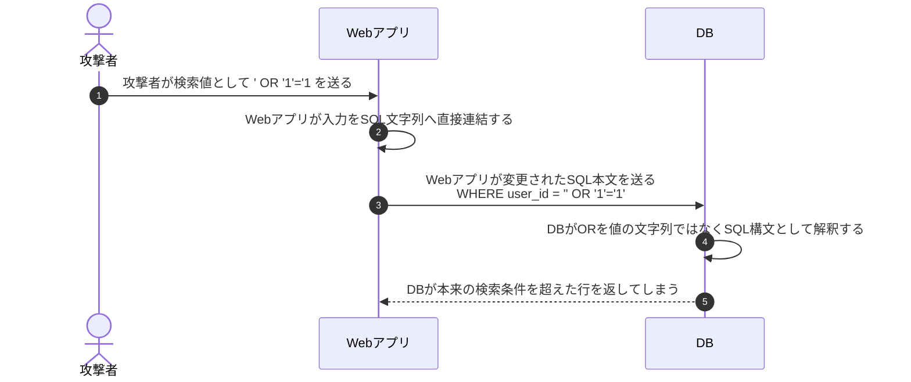
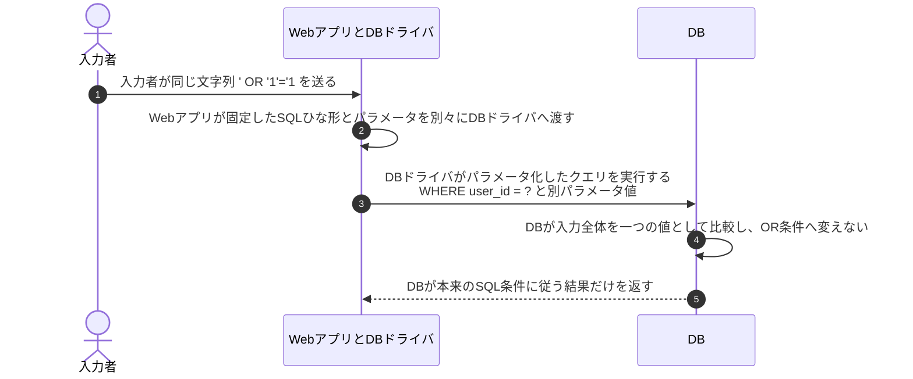

# SQLインジェクションとプレースホルダ

## 前提と登場人物

**SQLを組み立てるのはWebアプリ、SQLを実行するのはDB**である。攻撃者の文字列入力をuser_idの検索条件へ入れる例で、脆弱な文字列連結と、パラメータ化クエリを比較する。

## 全体像

図の内容を文字で読む

<!-- overview:start -->
要点: SQLの構造を固定し、入力を「値」として渡す。

補足: 上下は別実装の比較。攻撃者はWebアプリ経由でSQLへ影響させようとする。

| 段階 | 種類 | 主体 | 相手 | 内容 |
|---|---|---|---|---|
| 脆弱な実装の場合 | 送信 | 入力者 | Webアプリ | 検索値として ' OR '1'='1 を送る。 |
| 脆弱な実装の場合 | 送信 | Webアプリ | DB | 入力をSQL文字列へ直接連結し、変わってしまったSQL本文を送る。 |
| 脆弱な実装の場合 | 内部 | DB | — | ORをSQL構文と解釈し、本来の検索条件を超える行を選んでしまう。 |
| 対策した実装の場合 | 内部 | Webアプリ | — | 固定したSQLひな形と、入力されたパラメータ値を分離する。 |
| 対策した実装の場合 | 送信 | Webアプリ／ドライバ | DB | 正しいパラメータ化APIで、SQLひな形と値を別々に渡す。 |
| 対策した実装の場合 | 内部 | DB | — | 入力全体を一つの値として比較する。入力をOR条件へ変えない。 |
<!-- overview:end -->

詳しい手順・分岐を開く（Mermaid）

## 1. 脆弱な例：Webアプリが入力をSQL本文へ連結する

攻撃者がDBへ直接接続するのではなく、WebアプリがDBへ送るSQLの構造を入力経由で変えさせている。

## 2. 対策：WebアプリがSQLの構造と値を分離する

図の送信は論理的な処理である。prepareとexecuteの通信回数やプレースホルダ記号はDB・ドライバによる。単に`?`を文字列置換する自作処理ではなく、正しいパラメータ化APIを使う。

## 処理後に残るもの

| 主体 | 保持するもの・結果 |
|---|---|
| Webアプリ | SQLひな形、別パラメータとして渡す入力値、検索結果 |
| DB | SQLの構造に従った実行結果。入力を勝手にSQL構文へ昇格させない |
| 入力者 | アプリが返した応答。アプリ側の認可も別途必要 |

## 注意点

パラメータ化で束縛するのは値である。テーブル名・列名・並び順等を利用者が選べる場合は、固定候補へのマッピング等を使う。入力検証やWAFは補助策で、文字列連結による根本問題の修正を代替しない。

## 参照資料

- [OWASP：SQL Injection Prevention Cheat Sheet](https://cheatsheetseries.owasp.org/cheatsheets/SQL_Injection_Prevention_Cheat_Sheet.html)
