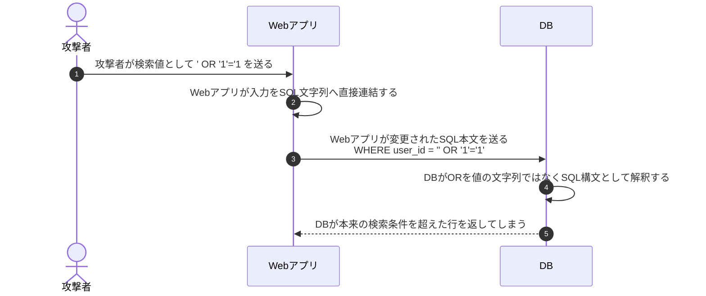
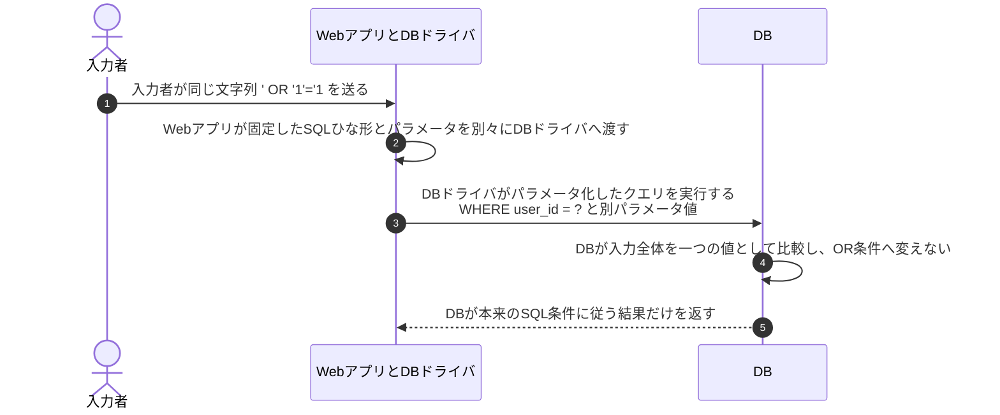

# SQLインジェクションとプレースホルダ

## 前提と登場人物

**SQLを組み立てるのはWebアプリ、SQLを実行するのはDB**である。攻撃者の文字列入力をuser_idの検索条件へ入れる例で、脆弱な文字列連結と、パラメータ化クエリを比較する。

## 1. 脆弱な例：Webアプリが入力をSQL本文へ連結する

攻撃者がDBへ直接接続するのではなく、WebアプリがDBへ送るSQLの構造を入力経由で変えさせている。

## 2. 対策：WebアプリがSQLの構造と値を分離する

図の送信は論理的な処理である。prepareとexecuteの通信回数やプレースホルダ記号はDB・ドライバによる。単に`?`を文字列置換する自作処理ではなく、正しいパラメータ化APIを使う。

## 処理後に残るもの

| 主体 | 保持するもの・結果 |
|---|---|
| Webアプリ | SQLひな形、別パラメータとして渡す入力値、検索結果 |
| DB | SQLの構造に従った実行結果。入力を勝手にSQL構文へ昇格させない |
| 入力者 | アプリが返した応答。アプリ側の認可も別途必要 |

## 注意点

パラメータ化で束縛するのは値である。テーブル名・列名・並び順等を利用者が選べる場合は、固定候補へのマッピング等を使う。入力検証やWAFは補助策で、文字列連結による根本問題の修正を代替しない。

## 参照資料

- [OWASP：SQL Injection Prevention Cheat Sheet](https://cheatsheetseries.owasp.org/cheatsheets/SQL_Injection_Prevention_Cheat_Sheet.html)
