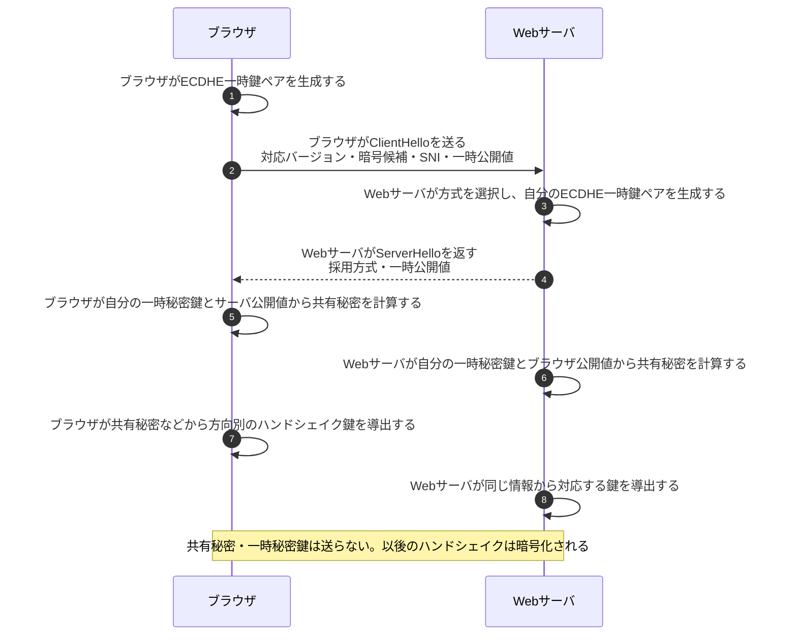
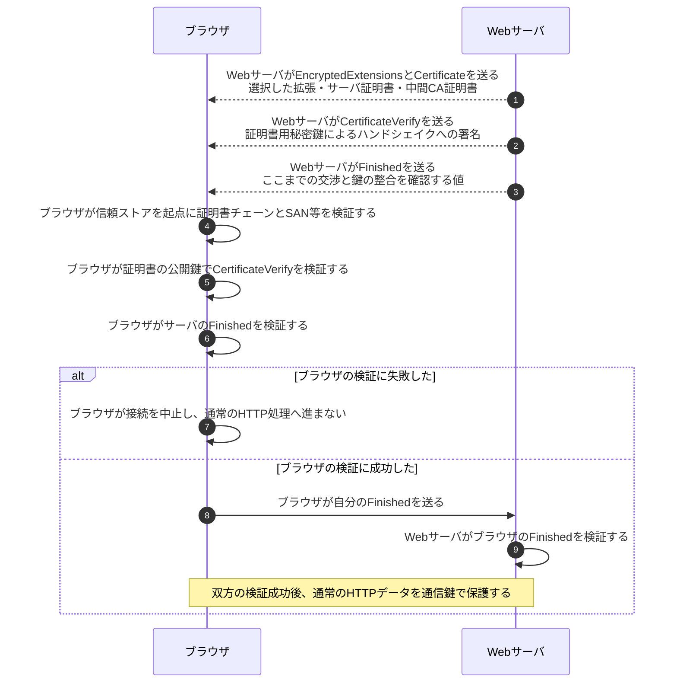

# TLS 1.3ハンドシェイク

## 前提と登場人物

**ブラウザとWebサーバがECDHEで鍵材料を計算し、ブラウザが証明書と署名でサーバを確認する**基本例である。TLS 1.3の証明書認証を使うフルハンドシェイクで、PSK再開、0-RTT、HelloRetryRequest、クライアント証明書認証は省略する。

サーバの証明書用秘密鍵と、接続ごとのECDHE一時秘密鍵は別物である。ブラウザは信頼済みルートCAをローカルの信頼ストアに保持している。

## 全体像

図の内容を文字で読む

<!-- overview:start -->
要点: 公開値で鍵を計算し、証明書と署名で相手を確認。

補足: 証明書認証のフルハンドシェイク。共有秘密は送らず、各検証の成功時だけ先へ進む。

| 段階 | 種類 | 主体 | 相手 | 内容 |
|---|---|---|---|---|
| 通信鍵の準備 | 交換 | ブラウザ | Webサーバ | ClientHello／ServerHelloで方式とECDHEの一時公開値を交換する。 |
| 通信鍵の準備 | 内部 | ブラウザ | — | 自分の一時秘密鍵と相手の公開値から共有秘密を計算し、鍵を導出する。 |
| 通信鍵の準備 | 内部 | Webサーバ | — | 自分の一時秘密鍵と相手の公開値で同じ共有秘密を計算し、鍵を導出する。 |
| サーバを確認 | 送信 | Webサーバ | ブラウザ | 暗号化したハンドシェイクで証明書・CertificateVerify・Finished等を送る。 |
| サーバを確認 | 確認 | ブラウザ | — | 証明書チェーン・SAN、証明書の公開鍵による署名、Finishedを検証する。 |
| 完了を確認 | 送信 | ブラウザ | Webサーバ | サーバの検証成功後、自分のFinishedを送る。 |
| 完了を確認 | 確認 | Webサーバ | — | ブラウザのFinishedを検証する。双方の成功後、通常のHTTP通信へ進む。 |
<!-- overview:end -->

詳しい手順・分岐を開く（Mermaid）

## 1. 公開値を交換し、各自が同じ共有秘密を計算する

SNIは接続したいサーバ名を知らせる情報で、相手を認証する証拠ではない。また「同じ共有秘密か」を通信で直接照合するのではなく、後のFinished等で鍵と交渉内容の整合を確認する。

## 2. ブラウザがサーバを検証し、双方がFinishedを検証する

サーバもFinishedの検証に失敗すれば接続を中止する。証明書の検証項目は[証明書チェーン検証](証明書チェーン検証.md)を参照する。CertificateVerifyは証明書用秘密鍵の保有を、Finishedは鍵とここまでの交渉内容の整合を確認する。**クライアント証明書を使わないこの例では、Finished成功はWebアプリの利用者ログインを意味しない。**

## 処理後に残るもの

| 主体 | 接続中に保持するもの | 送信しないもの・破棄するもの |
|---|---|---|
| ブラウザ | 方向別の通信鍵、相手の検証結果、信頼ストア | 一時秘密鍵・共有秘密を送らず、不要な鍵材料を適切に破棄する |
| Webサーバ | 対応する通信鍵、サーバ証明書用秘密鍵 | サーバ秘密鍵を送らず、不要な一時鍵材料を適切に破棄する |

## 注意点

TLS 1.3内部では共有秘密から複数の鍵を段階的に導出するが、セキスペ対策では個々のtraffic secretやIV生成式まで暗記せず、**ECDHEで共有秘密を作り、方向別の通信鍵を導出してAEADで通信を保護する**という関係を押さえる。詳しくは[AEADの図](AEADの暗号化と認証タグ検証.md)を参照する。

ECDHEの一時秘密鍵等を適切に破棄すれば、後から証明書用の長期秘密鍵が漏れても記録済み通信を復号しにくい。これがForward Secrecyであり、稼働中の端末から通信鍵そのものを盗まれた場合まで守る性質ではない。

## 参照資料

- [RFC 8446 §2・§4.4・§5・§7.1：TLS 1.3](https://www.rfc-editor.org/rfc/rfc8446.html)
