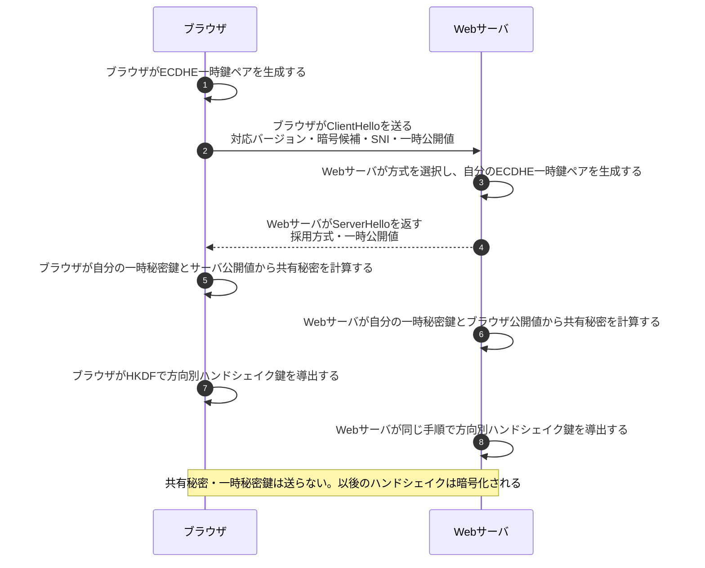
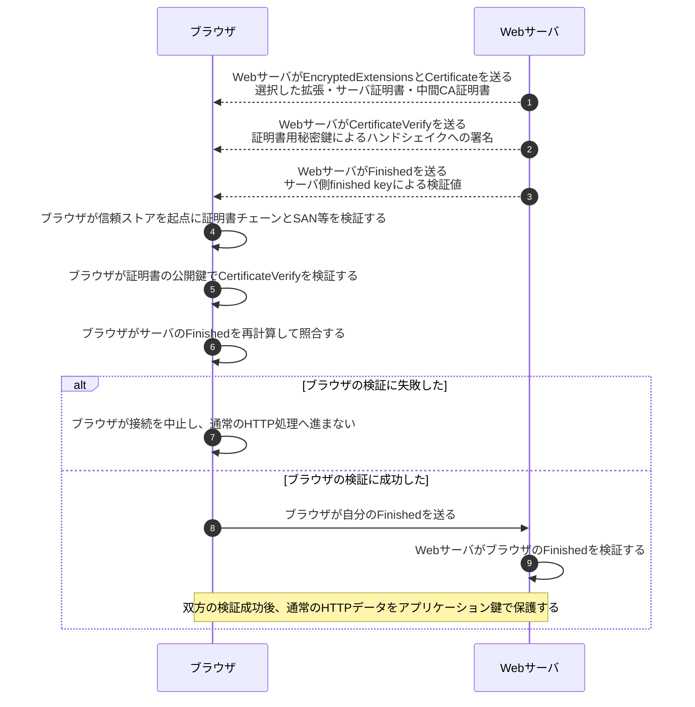
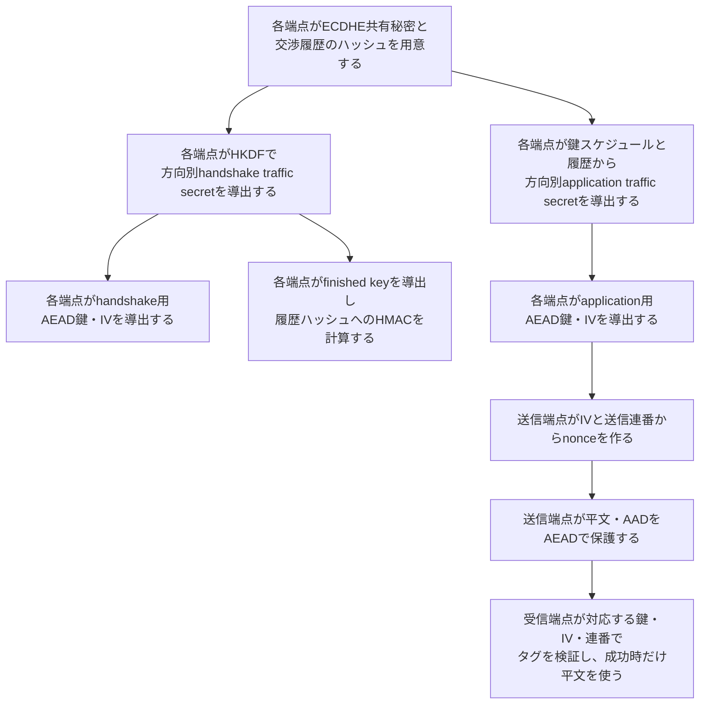

# TLS 1.3ハンドシェイク

## 前提と登場人物

**ブラウザとWebサーバがECDHEで鍵材料を計算し、ブラウザが証明書と署名でサーバを確認する**基本例である。TLS 1.3の証明書認証を使うフルハンドシェイクで、PSK再開、0-RTT、HelloRetryRequest、クライアント証明書認証は省略する。

サーバの証明書用秘密鍵と、接続ごとのECDHE一時秘密鍵は別物である。ブラウザは信頼済みルートCAをローカルの信頼ストアに保持している。

## 1. 公開値を交換し、各自が同じ共有秘密を計算する

SNIは接続したいサーバ名を知らせる情報で、相手を認証する証拠ではない。また「同じ共有秘密か」を通信で直接照合する手順はなく、後のFinished等で鍵と交渉内容の整合を確認する。

## 2. ブラウザがサーバを検証し、双方がFinishedを検証する

サーバもFinishedの検証に失敗すれば接続を中止する。証明書の検証項目は[証明書チェーン検証](証明書チェーン検証.md)を参照する。CertificateVerifyは証明書用秘密鍵の保有を、Finishedは鍵とここまでの交渉内容の整合を確認する。**クライアント証明書を使わないこの例では、Finished成功はWebアプリの利用者ログインを意味しない。**

## 3. 鍵材料から実際の暗号鍵を導出する

下図の矢印はネットワーク送信ではなく、**ブラウザとWebサーバがそれぞれ内部で行う計算の依存関係**である。HKDFの全中間値は省略している。

## 処理後に残るもの

| 主体 | 接続中に保持するもの | 送信しないもの・破棄するもの |
|---|---|---|
| ブラウザ | 方向別通信鍵・IV・連番、相手の検証結果、信頼ストア | 一時秘密鍵・共有秘密を送らず、不要な鍵材料を適切に破棄する |
| Webサーバ | 対応する方向別通信鍵・IV・連番、サーバ証明書用秘密鍵 | サーバ秘密鍵を送らず、不要な一時鍵材料を適切に破棄する |

## 注意点

一方の送信鍵を逆方向の送信鍵として使わない。TLSレコードはAES-GCMやChaCha20-Poly1305等のAEADで保護されるが、Finishedは別途導出した鍵によるHMACである。詳しくは[AEADの図](AEADの暗号化と認証タグ検証.md)を参照する。

ECDHEの一時秘密鍵等を適切に破棄すれば、後から証明書用の長期秘密鍵が漏れても記録済み通信を復号しにくい。これがForward Secrecyであり、稼働中の端末から通信鍵そのものを盗まれた場合まで守る性質ではない。

## 参照資料

- [RFC 8446 §2・§4.4・§5・§7.1：TLS 1.3](https://www.rfc-editor.org/rfc/rfc8446.html)
