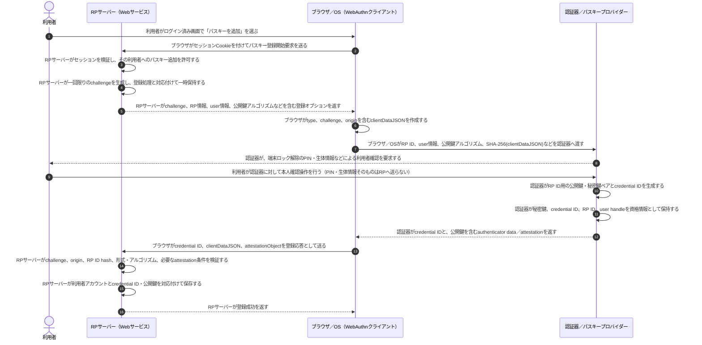
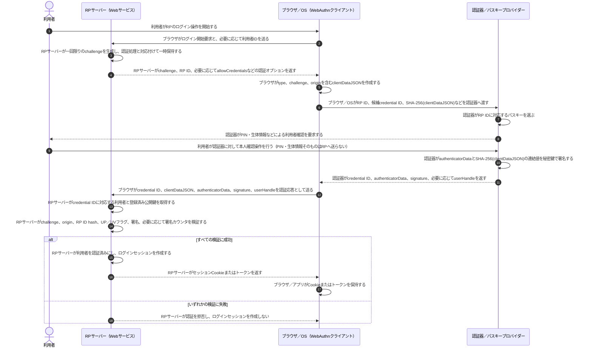
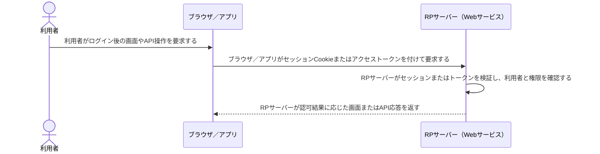
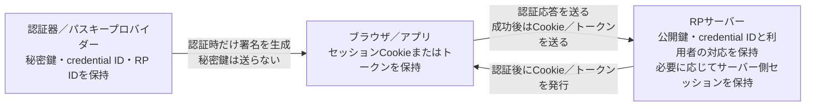

# WebAuthnとパスキー認証

パスキー認証では、**RP（Webサービス）は公開鍵を保持し、認証器は秘密鍵を保持する**。認証時に秘密鍵そのものを送るのではなく、RPが発行した一回限りのチャレンジを含むデータへ認証器が署名し、RPが公開鍵で検証する。

## 1. パスキー登録時

### 登録後に誰が何を保持するか

| 主体 | 継続して保持するもの | 保持しない／相手へ送らないもの |
|---|---|---|
| 認証器／パスキープロバイダー | 秘密鍵、credential ID、RP ID、user handleなど | 秘密鍵や生体情報をRPサーバーへ送らない |
| RPサーバー | 利用者アカウント、credential ID、公開鍵、必要に応じて署名カウンタなど | 利用者の秘密鍵や生体情報を保持しない |
| ブラウザ／OS | 登録処理中のオプションと応答を仲介する | 原則としてRP用秘密鍵をWebページへ渡さない |
| 利用者 | PINを記憶する場合がある | 指紋・顔などの生体情報は認証器側のローカル照合に使い、RPへ送らない |

## 2. パスキー認証時

### 認証時に実際に送るもの

| 送信者 → 受信者 | 主な送信物 | 受信者が行うこと |
|---|---|---|
| RPサーバー → ブラウザ／OS | `challenge`、RP ID、必要に応じて`allowCredentials` | ブラウザが`clientDataJSON`を作り、認証器へ処理を依頼する |
| ブラウザ／OS → 認証器 | RP ID、候補credential ID、`SHA-256(clientDataJSON)`など | 認証器がRP用資格情報を選び、利用者確認後に署名する |
| 認証器 → ブラウザ／OS | credential ID、`authenticatorData`、`signature`、必要に応じて`userHandle` | ブラウザがWebAuthn認証応答へまとめる |
| ブラウザ／OS → RPサーバー | credential ID、`clientDataJSON`、`authenticatorData`、`signature`、`userHandle` | RPが保存済み公開鍵と要求時の状態を使って検証する |
| RPサーバー → ブラウザ／アプリ | 認証成功後のセッションCookieまたはトークン | 以後のログイン済み通信で提示する |

秘密鍵、PIN、指紋・顔画像は、WebAuthn認証応答としてRPサーバーへ送られない。

## 3. 認証後の通常アクセス

WebAuthnの署名はログインを成立させるために使う。ログイン成功後の通常リクエストでは、一般に毎回WebAuthn署名を送り直すのではなく、RPが発行したセッションCookieやトークンを使う。

## 4. 認証後の保持状態

同期型パスキーでは、資格情報がOS・パスキープロバイダーの保護された仕組みを通じて利用者の端末間で同期される場合がある。この場合も、RPサーバーが保持するのは公開鍵側であり、RPへ秘密鍵が渡るわけではない。

## 参照資料

- [Web Authentication: An API for accessing Public Key Credentials - Level 3（W3C）](https://www.w3.org/TR/webauthn-3/)
- [Passkeys Developer Documentation](https://passkeys.dev/docs/)
- [FIDO Alliance Specifications Overview](https://fidoalliance.org/specifications-overview/)
