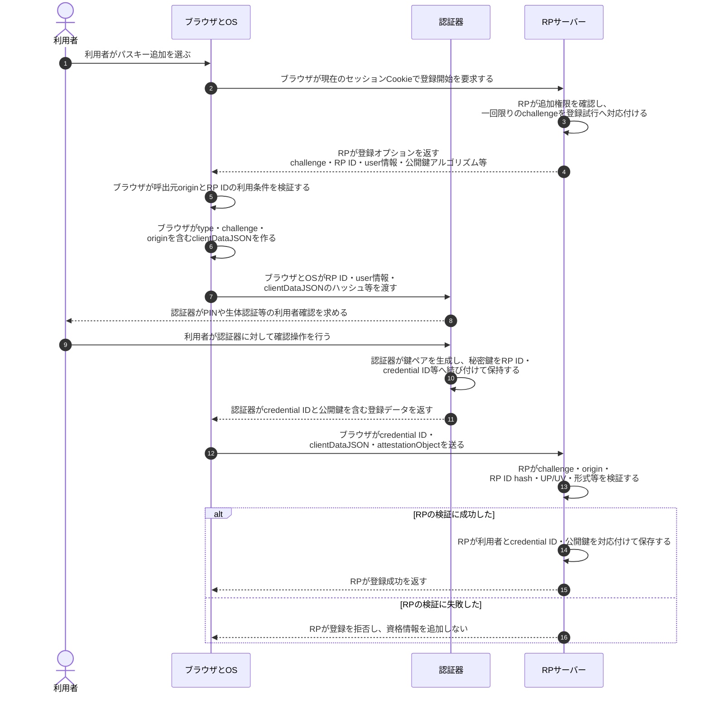
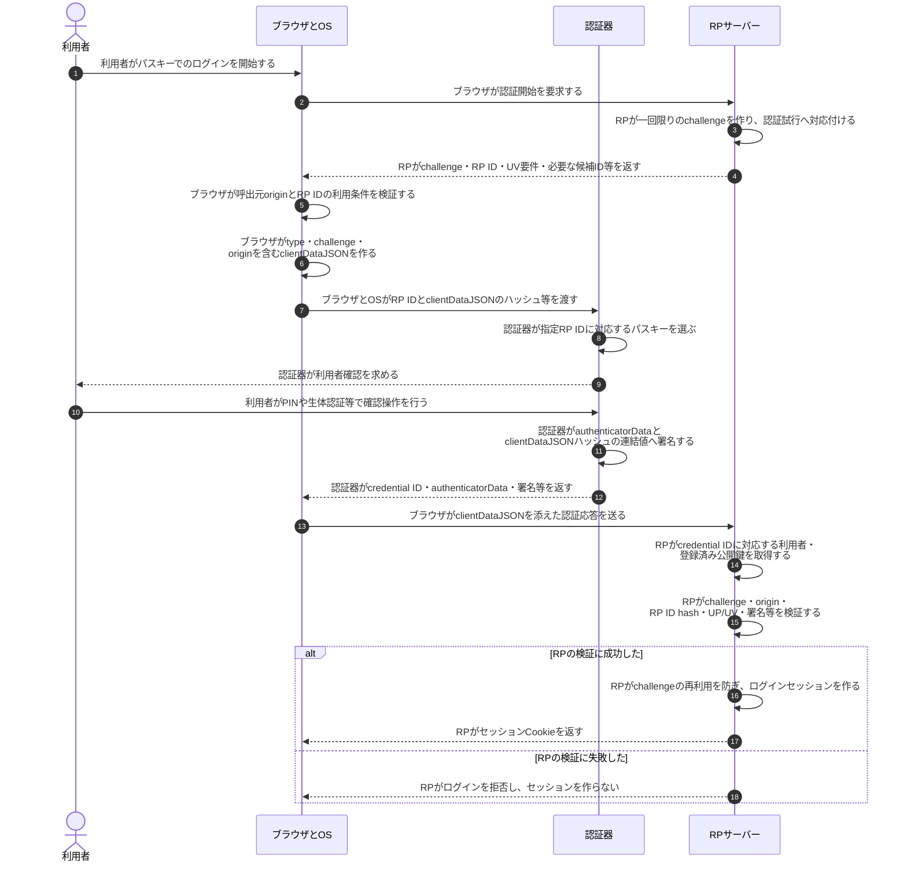
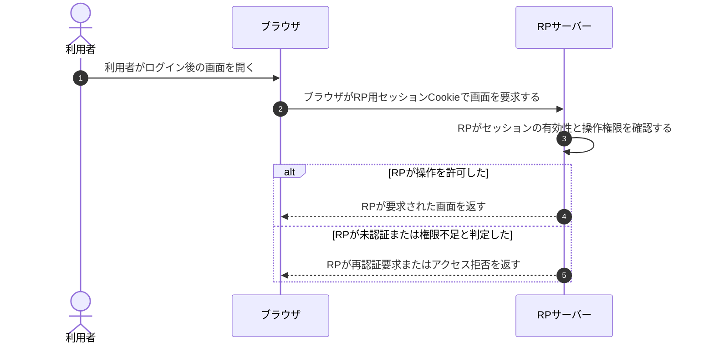

# WebAuthnとパスキー認証

## 前提と登場人物

**RPサーバーはWebサービス側、ブラウザ／OSと認証器は利用者側の役割**である。認証器は内蔵機能・セキュリティキー・パスキープロバイダー等であり、ブラウザと同じ端末にある場合もある。

この図は通常のWebオリジンからパスキーを登録・利用し、RPが利用者確認（UV）を要求する例である。iframeや関連オリジンの特例、アカウント回復は省略する。RPが保持するのは公開鍵側であり、秘密鍵・PIN・生体情報をRPへ渡さない。

## 全体像

図の内容を文字で読む

<!-- overview:start -->
要点: RPは公開鍵、認証器は秘密鍵。送るのは署名。

補足: 登録済みパスキーでのログイン例。秘密鍵・PIN・生体情報はRPへ送らない。

| 段階 | 種類 | 主体 | 相手 | 内容 |
|---|---|---|---|---|
| ログイン開始 | 送信 | RPサーバー | ブラウザ／OS | 一回限りのchallengeとRP ID、利用者確認の要件等を返す。 |
| 利用者側で署名 | 送信 | ブラウザ／OS | 認証器 | originとRP IDの利用条件を確認後、RP ID・clientDataJSONのハッシュ等を渡す。 |
| 利用者側で署名 | 内部 | 認証器 | — | 対象RPの鍵を選び、PIN等で利用者を確認して、認証データへ秘密鍵で署名する。 |
| 利用者側で署名 | 送信 | 認証器 | ブラウザ／OS | credential ID・authenticatorData・署名等を返す。秘密鍵は返さない。 |
| サービス側で検証 | 送信 | ブラウザ／OS | RPサーバー | 認証器の応答にclientDataJSONを添えて送る。 |
| サービス側で検証 | 確認 | RPサーバー | — | 登録公開鍵で署名を検証し、challenge・origin・RP ID hash・UP/UV等も確認する。 |
| 検証成功後 | 送信 | RPサーバー | ブラウザ／OS | challengeの再利用を防ぎ、ログイン用のセッションCookieを発行する。 |
<!-- overview:end -->

詳しい手順・分岐を開く（Mermaid）

## 1. パスキー登録時

登録する利用者は別の方法で本人確認済みとする。RPは単にログイン中かだけでなく、そのアカウントへ資格情報を追加してよいかを確認する。

ブラウザがRP IDの利用条件を満たさないと判断したら、認証器への処理依頼へ進まない。attestationを求める場合はRPの方針に従って検証するが、すべてのパスキー登録で機器の身元証明を要求するわけではない。

### 登録後に誰が何を保持するか

| 主体 | 継続して保持するもの | 相手へ渡さないもの |
|---|---|---|
| 認証器／パスキープロバイダー | 秘密鍵、credential ID、RP ID、user handle等 | RPへ秘密鍵・PIN・生体情報を送らない |
| RPサーバー | 利用者とcredential ID・公開鍵の対応、必要なカウンタ等 | 利用者の秘密鍵・生体情報は保持しない |
| ブラウザ／OS | WebAuthn呼出しの仲介情報、サービスのCookie等 | Webページへ秘密鍵を渡さない |

## 2. パスキー認証時

認証応答には必要に応じてuserHandleも含まれる。RPはtypeや署名カウンタ等も仕様・構成に応じて確認する。**ブラウザがoriginとRP IDの利用条件を確認し、認証器がRP IDに対応する鍵を選び、RPがoriginや署名を検証する**という役割分担である。どれか一つだけで済ませない。

## 3. 認証後の通常アクセス

WebAuthn署名を毎回のHTTPリクエストへ付けるわけではない。図はCookie型の例であり、アプリの構成に応じて別のセッション／トークン方式もある。

## 処理後に残るもの

| 主体 | 認証後に保持するもの | 一時情報の扱い |
|---|---|---|
| 認証器／プロバイダー | RP IDに結び付く秘密鍵等 | 署名を生成して返しても秘密鍵はRPへ移らない |
| RPサーバー | 登録公開鍵、利用者との対応、ログインセッション | challengeを認証試行に結び付け、期限・再利用を管理する |
| ブラウザ | RP用セッションCookie | 署名応答を将来のログインへ使い回さない |

## 注意点

同期型パスキーでは、秘密鍵を含む資格情報がプロバイダーの保護された仕組みで端末間同期される場合がある。「秘密鍵はRPへ送らない」と「秘密鍵は物理端末から絶対に出ない」は同義ではない。

指紋や顔は認証器側のローカル照合に使う。RPが受け取るUVフラグは確認実施の結果であり、生体情報そのものではない。パスキー登録済みでも通常アクセスの認可・Cookie保護・XSS対策は別途必要である。

## 参照資料

- [W3C WebAuthn Level 3 §5・§6・§7：RP ID、認証器、登録・認証検証](https://www.w3.org/TR/webauthn-3/)
- [FIDO Alliance：Passkeys](https://fidoalliance.org/passkeys/)
