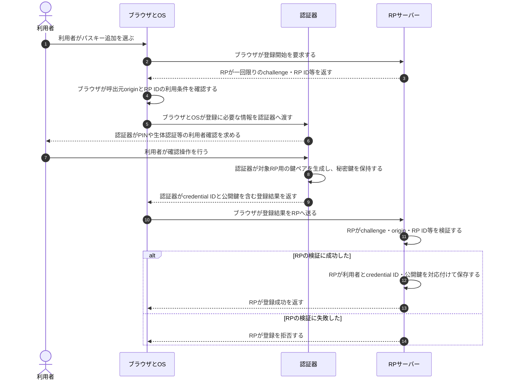
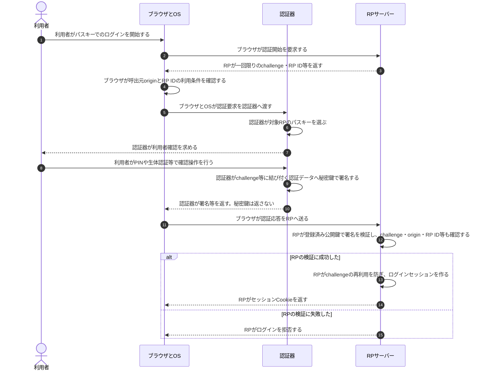

# WebAuthnとパスキー認証

## 前提と登場人物

**RPサーバーはWebサービス側、ブラウザ／OSと認証器は利用者側の役割**である。認証器は内蔵機能・セキュリティキー・パスキープロバイダー等であり、ブラウザと同じ端末にある場合もある。

この図は通常のWebオリジンからパスキーを登録・利用し、RPが利用者確認（UV）を要求する例である。RPが保持するのは公開鍵側であり、秘密鍵・PIN・生体情報をRPへ渡さない。

## 全体像

図の内容を文字で読む

<!-- overview:start -->
要点: RPは公開鍵、認証器は秘密鍵。送るのは署名。

補足: 登録済みパスキーでのログイン例。秘密鍵・PIN・生体情報はRPへ送らない。

| 段階 | 種類 | 主体 | 相手 | 内容 |
|---|---|---|---|---|
| ログイン開始 | 送信 | RPサーバー | ブラウザ／OS | 一回限りのchallengeとRP ID、利用者確認の要件等を返す。 |
| 利用者側で署名 | 送信 | ブラウザ／OS | 認証器 | originとRP IDの利用条件を確認後、RP ID・clientDataJSONのハッシュ等を渡す。 |
| 利用者側で署名 | 内部 | 認証器 | — | 対象RPの鍵を選び、PIN等で利用者を確認して、認証データへ秘密鍵で署名する。 |
| 利用者側で署名 | 送信 | 認証器 | ブラウザ／OS | credential ID・authenticatorData・署名等を返す。秘密鍵は返さない。 |
| サービス側で検証 | 送信 | ブラウザ／OS | RPサーバー | 認証器の応答にclientDataJSONを添えて送る。 |
| サービス側で検証 | 確認 | RPサーバー | — | 登録公開鍵で署名を検証し、challenge・origin・RP ID hash・UP/UV等も確認する。 |
| 検証成功後 | 送信 | RPサーバー | ブラウザ／OS | challengeの再利用を防ぎ、ログイン用のセッションCookieを発行する。 |
<!-- overview:end -->

詳しい手順・分岐を開く（Mermaid）

## 1. パスキー登録時

登録する利用者は別の方法で本人確認済みとする。

登録時の詳細なデータ構造やattestationの方式は実装・構成によって異なる。セキスペ対策では、**認証器が秘密鍵を保持し、RPは対応する公開鍵を登録する**ことを優先して押さえる。

## 2. パスキー認証時

**ブラウザがoriginとRP IDの利用条件を確認し、認証器がRPに対応する秘密鍵で署名し、RPが登録公開鍵で検証する**という役割分担を押さえる。`clientDataJSON`や`authenticatorData`の内部フィールド名、署名カウンタ等は、問題文で要求されない限り暗記対象にしない。

## 処理後に残るもの

| 主体 | 認証後に保持するもの |
|---|---|
| 認証器／パスキープロバイダー | RPに結び付く秘密鍵等。秘密鍵・PIN・生体情報をRPへ渡さない |
| RPサーバー | 登録公開鍵、利用者との対応、ログインセッション |
| ブラウザ | RP用セッションCookie等。認証器とRPのやり取りを仲介する |

## 注意点

パスキーがフィッシング耐性を持ちやすい理由は、資格情報がRP ID・originへ結び付くことと、秘密鍵そのものを偽サイトやRPへ送らないことにある。

同期型パスキーでは資格情報が保護された仕組みで端末間同期される場合があるため、「RPへ秘密鍵を送らない」と「秘密鍵が物理端末から絶対に出ない」は同義ではない。これは理解補助の補足であり、通常の試験回答ではまず公開鍵認証の流れを優先する。

## 参照資料

- [W3C WebAuthn Level 3 §5・§6・§7：RP ID、認証器、登録・認証検証](https://www.w3.org/TR/webauthn-3/)
- [FIDO Alliance：Passkeys](https://fidoalliance.org/passkeys/)
