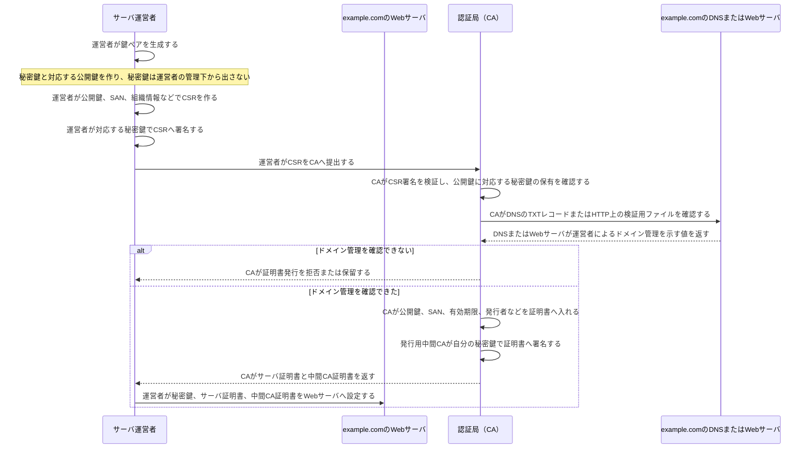

# サーバ証明書の発行

これは、Webサイト運営者が `example.com` 用のサーバ証明書をCAから受け取るまでの流れです。ブラウザが後で証明書を**検証する**流れとは別で、こちらは証明書を**発行する**流れです。

## 各段階で「誰が何を持つか」

| 段階 | 主体 | 持つもの・行うこと |
|---|---|---|
| 鍵ペア生成 | サーバ運営者 | 秘密鍵と公開鍵を作る。**秘密鍵はCAへ送らない**。 |
| CSR作成 | サーバ運営者 | 公開鍵、利用するDNS名（SAN）、必要に応じて組織情報を入れ、秘密鍵でCSRへ署名する。 |
| ドメイン管理確認 | CA | DNSのTXTレコード、HTTPの検証用ファイルなどを用い、申請者が`example.com`を管理できるか確認する。 |
| 証明書署名 | 発行用中間CA | CAの秘密鍵で、公開鍵・SAN・有効期限などを含む証明書へ署名する。 |
| サーバ設定 | サーバ運営者 | 秘密鍵と証明書チェーンをWebサーバへ設定する。HTTPS接続時に、Webサーバは証明書と中間CA証明書をブラウザへ送る。 |

## 覚えるポイント

- CSRに入れるのは**公開鍵**。秘密鍵は送らない。
- CAが確認する中心は「この申請者は、そのドメインを管理できるか」。DV証明書では組織の実在性まで保証するとは限りません。
- 「CAが署名する」のは、通常、ルートCAではなく**発行用中間CA**です。ブラウザは信頼ストアのルートCAを起点に、その中間CAの署名を後で検証します。
- CSRの署名は「対応する秘密鍵を持つ」ことの確認、CAの署名は「CAがこの公開鍵とドメイン名の対応を証明書として発行した」ことの確認です。役割が異なります。
