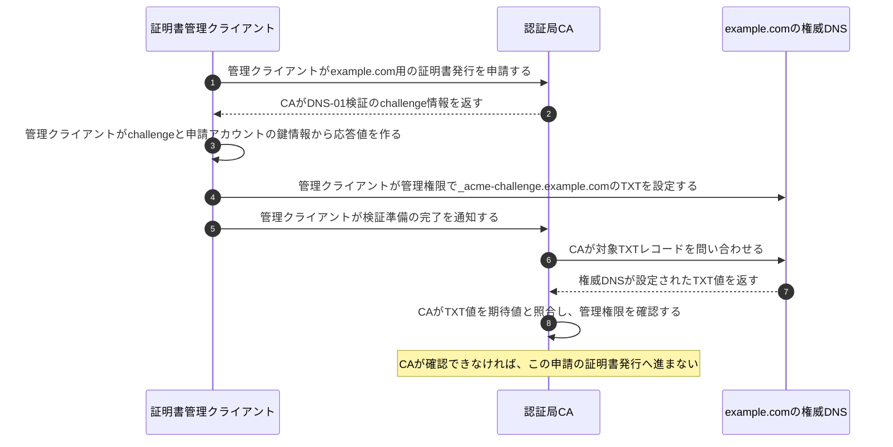
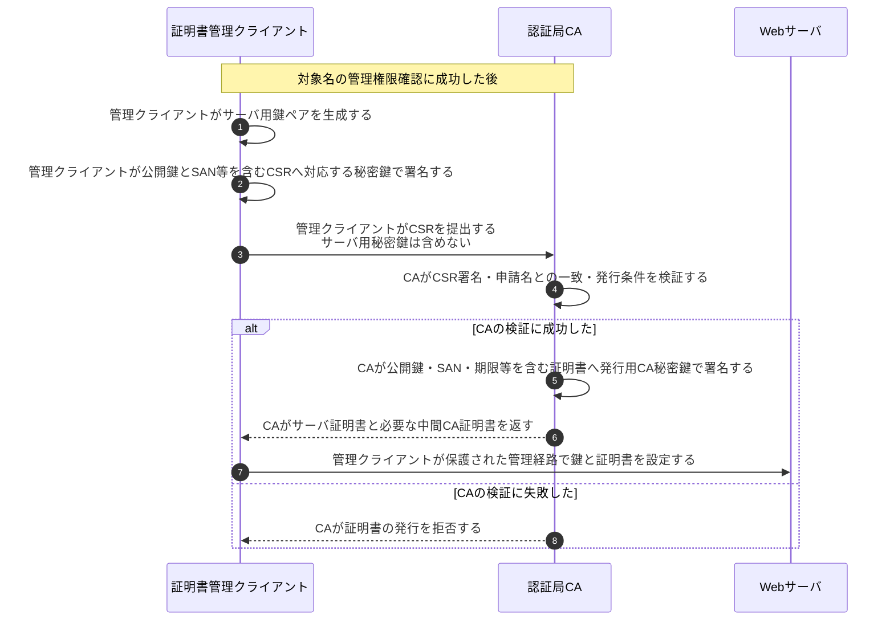

# サーバ証明書の発行

## 前提と登場人物

**証明書を申請するのは運営者側の証明書管理クライアント、ドメイン管理を確認して署名するのはCA**である。これは発行の図であり、接続時の[証明書検証](証明書チェーン検証.md)とは別である。

以下は`example.com`のDNS管理権限を検証するACMEのDNS-01相当の構成例である。運営者は証明書管理クライアントと権威DNS、Webサーバを管理し、CAとの申請用アカウントは準備済みとする。ポーリング等の詳細は省略する。

## 全体像

図の内容を文字で読む

<!-- overview:start -->
要点: CAはドメインの管理権限とCSRを確認して発行。

補足: ACME DNS-01の例。サーバ用秘密鍵をCAへ提出するわけではない。

| 段階 | 種類 | 主体 | 相手 | 内容 |
|---|---|---|---|---|
| ドメイン管理を確認 | 交換 | 証明書管理クライアント | 認証局CA | example.comの証明書を申請し、DNS-01のchallenge情報を受け取る。 |
| ドメイン管理を確認 | 送信 | 証明書管理クライアント | 権威DNS | 管理権限を使い、_acme-challenge.example.comのTXTに応答値を設定する。 |
| ドメイン管理を確認 | 交換 | 認証局CA | 権威DNS | 準備完了の通知後、対象TXTを取得し、期待値と照合する。 |
| 鍵と名前を証明書へ | 送信 | 証明書管理クライアント | 認証局CA | 公開鍵・SAN等を含む署名済みCSRを提出する。秘密鍵は含めない。 |
| 鍵と名前を証明書へ | 確認 | 認証局CA | — | CSRの署名・申請名・発行条件を検証し、CAの鍵で証明書へ署名する。 |
| 鍵と名前を証明書へ | 送信 | 認証局CA | 証明書管理クライアント | サーバ証明書と必要な中間CA証明書を返す。 |
| 運営者側で配備 | 送信 | 証明書管理クライアント | Webサーバ | 保護された管理経路でサーバ用の鍵と証明書を設定する。 |
<!-- overview:end -->

詳しい手順・分岐を開く（Mermaid）

## 1. CAがドメイン管理を確認する

## 2. CAがCSRを確認して証明書を発行する

サーバ用鍵をサーバ内やHSMで生成し、秘密鍵を移動しない構成もある。図の配備は運営者の管理範囲内で行い、CAへ秘密鍵を預けるという意味ではない。

## 処理後に残るもの

| 主体 | 保持するもの | 渡さないもの |
|---|---|---|
| 運営者側／Webサーバ | サーバ秘密鍵、サーバ証明書、中間CA証明書 | HTTPSの相手やCAへサーバ秘密鍵を送らない |
| CA | 発行記録、CA署名秘密鍵 | 申請者へCA秘密鍵を送らない |
| 権威DNS | 検証時の公開TXT値 | サーバ用秘密鍵は保持しない |

## 注意点

CSRの署名は「その公開鍵に対応する秘密鍵の保有」を示し、DNS検証は「そのドメインの管理権限」を確認する。CAの証明書署名は、それらを発行ポリシーの下で結び付ける。ACMEの申請アカウント鍵とサーバ証明書用の鍵も別の役割である。

DVは組織の実在性やサイト内容の安全性まで保証しない。発行に使うのは通常中間CAの鍵であり、ルートCAが毎回直接サーバ証明書へ署名するわけではない。HTTPによる検証等の別方式を、このDNS-01の図に混在させない。

## 参照資料

- [RFC 8555 §7・§8.4：証明書発行とDNS-01](https://www.rfc-editor.org/rfc/rfc8555.html)
- [RFC 5280 §4：証明書の内容](https://www.rfc-editor.org/rfc/rfc5280.html)
