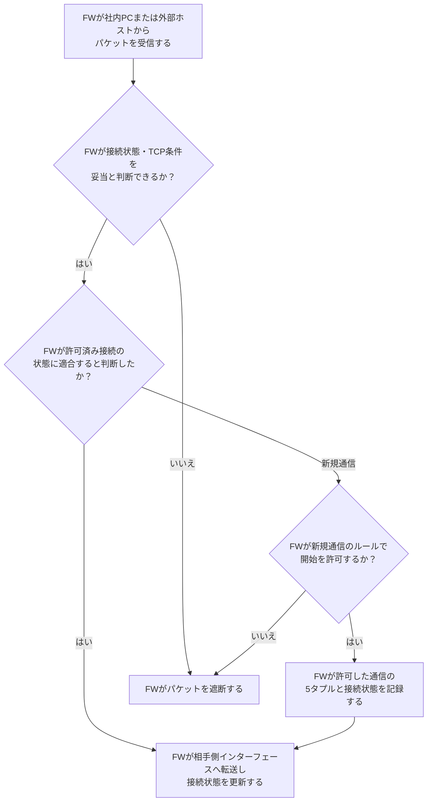

# ステートフルファイアウォール

## 前提と登場人物

**パケットを許可・遮断し、接続状態を保持するのはFW**である。社内PCから外部WebサーバへのHTTPS接続を許可し、外部から社内への新規接続は原則拒否するルールを想定する。戻り通信も同じFWが観測できる経路とする。

この図はTCPパケットに対するFW内の判断の概略である。実際のTCP状態遷移や製品ごとの評価順は省略する。

## 全体像

図の内容を文字で読む

<!-- overview:start -->
要点: 既存接続は状態、新規接続は開始ルールでも判断。

補足: 条件別の経路を示す。下の二経路を両方実行するわけではない。不正・不許可なら遮断。

| 段階 | 種類 | 主体 | 相手 | 内容 |
|---|---|---|---|---|
| 共通：受信して分類 | 確認 | ファイアウォール | — | パケットのTCP条件と接続状態を確認し、既存接続か新規接続かを判断する。 |
| 経路A：許可済みの既存接続 | 確認 | ファイアウォール | — | 逆方向の組合せも含め、パケットが許可済み接続の状態に適合するか確認する。 |
| 経路A：許可済みの既存接続 | 内部 | ファイアウォール | — | 適合する通信の接続状態を更新し、転送を許可する。 |
| 経路B：新規接続 | 確認 | ファイアウォール | — | 新規通信のルールで、接続開始を許可するか判断する。 |
| 経路B：新規接続 | 内部 | ファイアウォール | — | 許可した通信の5タプルと状態を記録し、転送を許可する。 |
<!-- overview:end -->

詳しい手順・分岐を開く（Mermaid）

## FWが接続状態と許可ルールを使い分ける

たとえば社内PCの`10.0.0.10:53000`から外部の`203.0.113.10:443`へTCP接続を始めると、FWは開始を許可するルールに従って状態を記録する。応答は逆方向の組合せとTCP状態等で対応付ける。開始直後から無条件に`ESTABLISHED`扱いするわけではない。

## 処理後に残るもの

| 主体 | 保持するもの |
|---|---|
| FW | 許可・拒否ルール、プロトコル・送受信IP・送受信ポートの5タプル、TCP状態・期限等 |
| 社内PC／外部Webサーバ | それぞれのTCP接続状態。FWの状態表を受け取るわけではない |

## 注意点

**状態表にないことだけで、新規通信が必ず拒否されるわけではない。** 新規通信は開始用ルールで判断する。この例では外部発の新規SYNは原則拒否だが、公開サービスへの明示的な許可があれば別である。

単純なステートレスACLは通常、接続履歴を持たず各パケットの条件を評価する。ステートフルでも通信内容の安全性を保証するものではなく、許可済み通信上の攻撃には別の対策が必要である。

## 参照資料

- [Netfilter：Connection trackingの状態情報](https://wiki.nftables.org/wiki-nftables/index.php/Matching_connection_tracking_stateful_metainformation)
