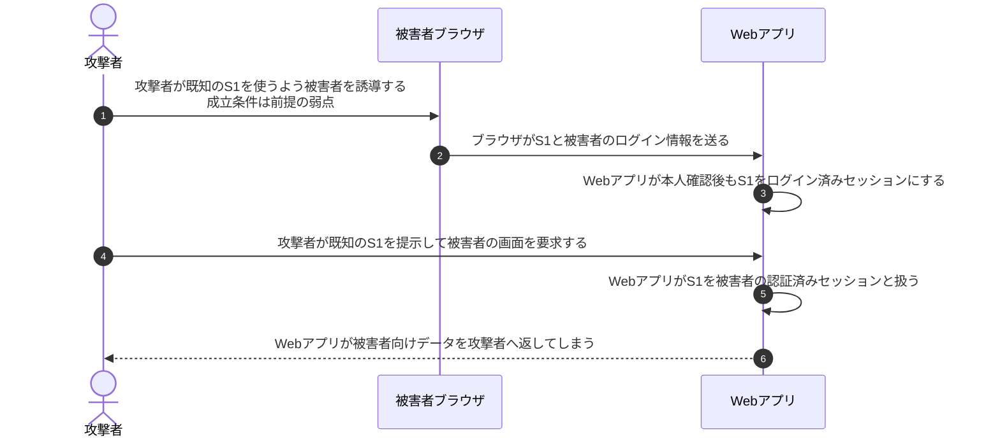
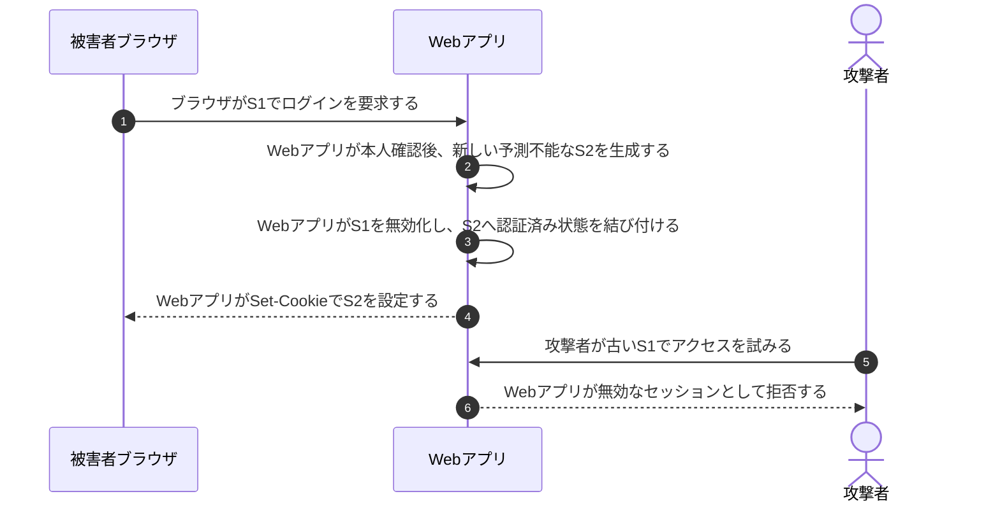

# セッション固定とCookie属性

## 前提と登場人物

攻撃者が知るセッションID`S1`を被害者に使わせられる、**セッション固定につながる弱点がWebアプリにある**と仮定する。任意の攻撃者サイトが他サイトのCookieを自由に設定できるという意味ではない。

被害者ブラウザと攻撃者のクライアントは別である。Webアプリがログイン後もS1を使い続けるか、新しいS2へ切り替えるかを比較する。

## 1. 脆弱な例：Webアプリがログイン前のIDを使い続ける

## 2. 対策：Webアプリが旧IDを無効化して新IDを発行する

## 処理後に残るもの

| 主体 | 対策後に保持するもの |
|---|---|
| Webアプリ | S2と認証済み利用者の対応。S1からは認証済み状態を利用できない |
| 被害者ブラウザ | 新しいセッションCookie S2 |
| 攻撃者 | 既知のS1。S2を推測できず、S1は認証済みアクセスに使えない |

## Cookie属性を実施する主体

| 設定 | 実施する主体と作用 | 代替できない対策 |
|---|---|---|
| Secure | ブラウザがCookieを安全な通信へ限定して送る | セッションID再生成、XSS対策 |
| HttpOnly | ブラウザがJavaScriptからのCookie読取りを制限する | XSS自体の防止、XSSによる認証済み要求の防止 |
| SameSite | ブラウザがクロスサイト要求へのCookie付与を制限する | 全種類のCSRF対策、セッションID再生成 |

## 注意点

ログイン成功や権限変更時のID再生成と、旧IDの無効化をセットにする。IDをCookieへ保存しただけでセッション固定が解決するわけではない。Webアプリは期限・ログアウト時の失効・権限確認も行う。

## 参照資料

- [OWASP：Session Management Cheat Sheet](https://cheatsheetseries.owasp.org/cheatsheets/Session_Management_Cheat_Sheet.html)
