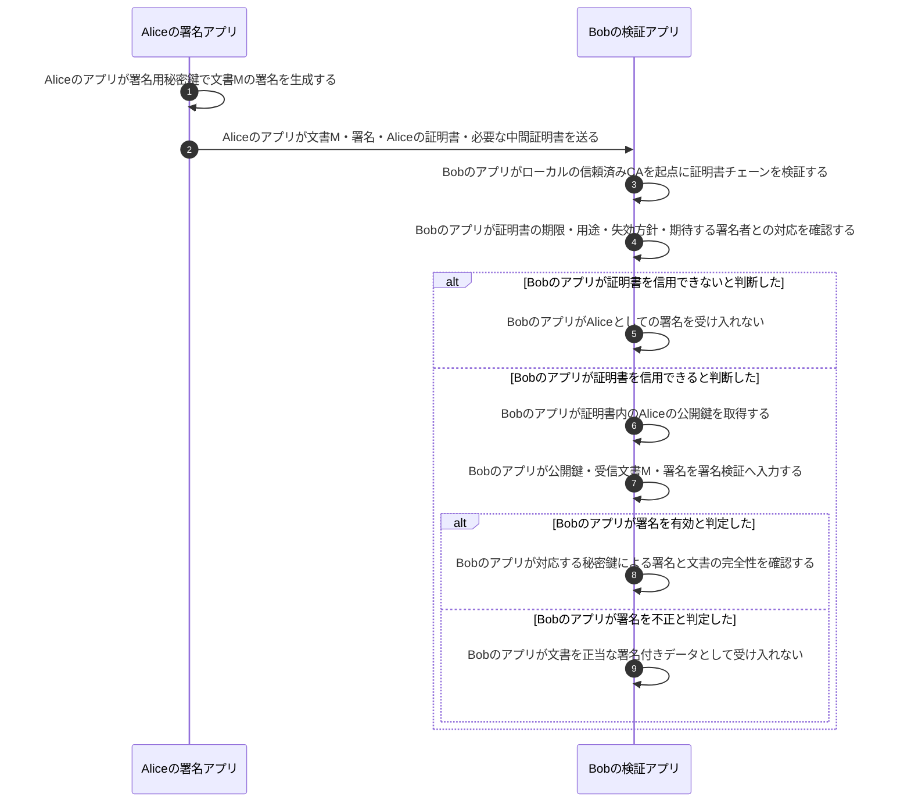

# デジタル署名とデジタル証明書

## 前提と登場人物

**送信者はデータへ署名し、受信者は「検証鍵を信用できるか」と「データの署名が正しいか」を別々に確認する。** ここではAliceの文書署名用証明書がCAから発行済みで、Bobは信頼済みCAをローカルに設定済みとする。

この図は署名と証明書の役割に集中し、データの暗号化は含めない。機密性が必要ならTLSや暗号化コンテナ等を別途使う。証明書の申請・発行処理と受信時の検証処理を混ぜない。

## Bobが証明書を検証してからデータの署名を検証する

## 処理後に残るもの

| 主体 | 保持するもの | 相手へ渡さないもの |
|---|---|---|
| Aliceの署名アプリ | Aliceの秘密鍵・証明書・文書 | 秘密鍵はBobへ送らない |
| Bobの検証アプリ | 信頼済みCA情報、受信文書・署名・証明書、検証結果 | AliceやCAの秘密鍵は不要 |
| CA | 発行ポリシー・発行記録・CA秘密鍵 | CA秘密鍵は証明書に含めない |

## 注意点

CAの署名は**証明書内の公開鍵と識別情報の結び付き**を支える。Aliceの署名は**文書M**を対象にする。この二つの署名は、署名者・署名対象・検証鍵が異なる。

証明書を受け取っただけで信用するのではなく、事前の信頼情報につながるか確認する。署名が有効でも内容の無害性や最新性まで保証しない。署名単体の処理は[デジタル署名](デジタル署名.md)、TLS用途の検証は[証明書チェーン検証](証明書チェーン検証.md)を参照する。

## 参照資料

- [RFC 5280 §4・§6：証明書とパス検証](https://www.rfc-editor.org/rfc/rfc5280.html)
- [NIST：Digital signature](https://csrc.nist.gov/glossary/term/digital_signature)
