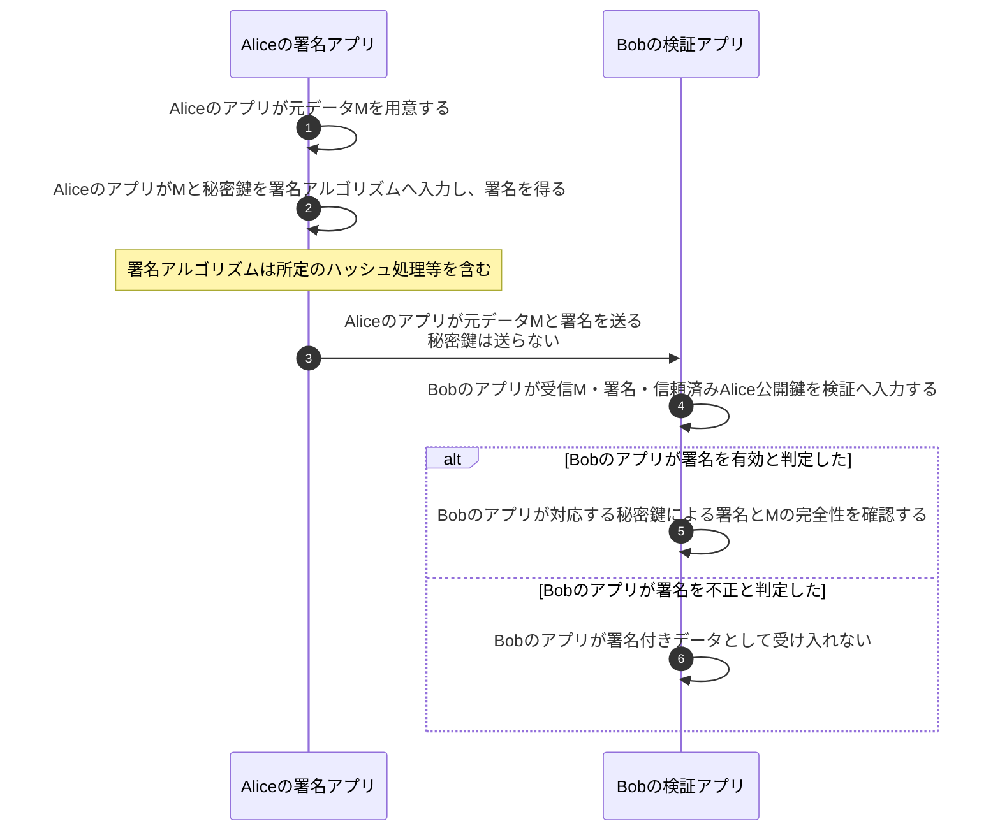

# デジタル署名

## 前提と登場人物

**Aliceの署名アプリが秘密鍵で署名し、Bobの検証アプリが公開鍵で検証する。** BobはAliceの正しい公開鍵を信頼できる方法で取得済みとする。公開鍵をどう信用するかは[デジタル署名と証明書](デジタル署名+デジタル証明書.md)で扱う。

署名は暗号化とは別である。この図では元データをそのまま送り、共通鍵の共有や復号を途中へ持ち込まない。

## 全体像

図の内容を文字で読む

<!-- overview:start -->
要点: 秘密鍵で署名。正しい公開鍵で検証。暗号化ではない。

補足: BobはAliceの正しい公開鍵を取得済み。文書を秘密にするには別の暗号化が必要。

| 段階 | 種類 | 主体 | 相手 | 内容 |
|---|---|---|---|---|
| 作成して送る | 内部 | Aliceの署名アプリ | — | 元データMと秘密鍵を署名アルゴリズムへ入力し、署名を得る。 |
| 作成して送る | 送信 | Aliceの署名アプリ | Bobの検証アプリ | 元データMと署名を送る。秘密鍵は送らない。 |
| 受け取って検証 | 確認 | Bobの検証アプリ | — | 受信したM・署名・信頼済みのAlice公開鍵を、署名検証へ入力する。 |
| 受け取って検証 | 確認 | Bobの検証アプリ | — | 有効なら対応する秘密鍵による署名とMの完全性を確認。不正なら受け入れない。 |
<!-- overview:end -->

詳しい手順・分岐を開く（Mermaid）

## 署名アプリと検証アプリの役割

## 処理後に残るもの

| 主体 | 保持するもの | 保持しないもの |
|---|---|---|
| Aliceの署名アプリ | 秘密鍵、元データ、生成した署名 | Bobへ秘密鍵を渡さない |
| Bobの検証アプリ | 信頼済み公開鍵、受信データと署名、検証結果 | Aliceの秘密鍵は不要 |

## 注意点

多くの署名方式ではデータのハッシュを利用する。大量のデータを固定長の値へまとめることで効率よく扱え、検証者が同じデータを基に署名を確認できる。ただし**「署名＝秘密鍵でハッシュを暗号化」ではない**。RSA、ECDSA、EdDSA等で手順は異なり、標準の署名・検証APIを使う。APIの指定なしに手作業でハッシュ化すると二重ハッシュ等の誤りにつながる。

署名の有効性は、内容が事実であること、無害であること、再送されていないことを保証しない。データを秘密にしたい場合は別の暗号化が必要である。否認防止を論じる場合も、鍵管理や本人と公開鍵の対応等の前提を含めて考える。

## 参照資料

- [NIST：Digital signature](https://csrc.nist.gov/glossary/term/digital_signature)
- [RFC 8032 §5：EdDSAの署名・検証アルゴリズム](https://www.rfc-editor.org/rfc/rfc8032.html)
