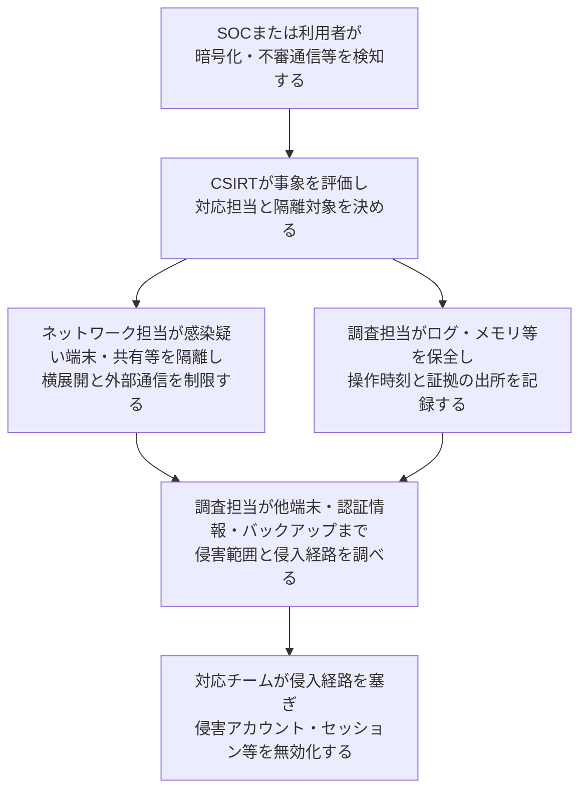
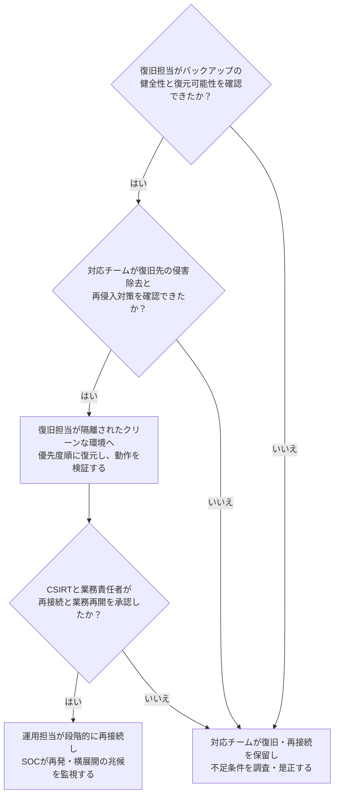

# ランサムウェア初動から復旧

## 前提と登場人物

これは組織のインシデント対応の概略である。**CSIRTが判断・調整し、ネットワーク担当が隔離、調査担当が証拠保全、復旧担当が復元する**。小規模な組織では一人が複数の役割を兼ねることもある。

図は判断のつながりを示すもので、全作業を必ず直列に終える手順ではない。被害拡大防止と証拠保全は並行して調整し、業務・人命への影響も考慮する。

## 1. 対応チームが被害拡大を止め、範囲を調べる

端末一台やDBだけを隔離して完了とはしない。バックアップ基盤へのアクセスも保護する。揮発性の証拠を失うため電源断を機械的な初手にはせず、通信遮断の可否と被害状況に応じて判断する。

## 2. 復旧担当が条件を確認して段階的に戻す

## 処理後に残るもの

| 主体 | 保持するもの・結果 |
|---|---|
| CSIRT | 影響範囲、意思決定、連絡記録、再発防止課題 |
| 調査担当 | 保全証拠、時系列、侵入・横展開の調査結果 |
| 復旧・運用担当 | 検証済み復元データ、変更記録、クリーンな環境 |
| SOC | 復旧後の監視条件と検知・対応記録 |

## 注意点

復元できたことと、侵害を取り除けたことは別である。バックアップが存在するだけでも復旧可とは判断しない。情報流出の評価、組織内外への連絡、必要な報告、教訓の反映も対応の一部だが、この図は技術的な封じ込めから復旧を中心に示している。

## 参照資料

- [CISA：#StopRansomware Guide（Response Checklist）](https://www.cisa.gov/stopransomware/ransomware-guide)
