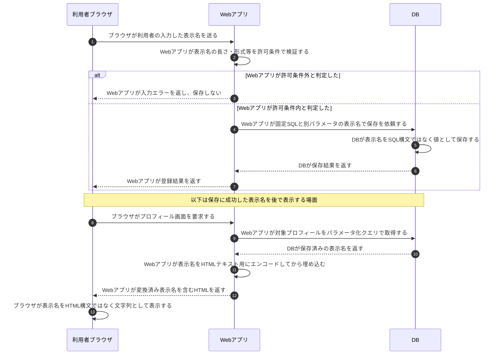

# 入力検証と出力エンコーディング

## 前提と登場人物

利用者がプロフィールの表示名を登録し、後でHTML画面へ表示する例である。**Webアプリが入力の業務条件を検証し、DB操作では値を束縛し、表示時には出力先に合う変換をする。** 三つは別の防御である。

この図の出力先はHTMLの通常のテキスト部分とする。JavaScriptコード、URL、CSS、HTML属性へ埋め込む場合は、それぞれの文脈に合う処理が別途必要である。

## 保存時と表示時で対策を使い分ける

## 処理後に残るもの

| 主体 | 保持するもの・結果 |
|---|---|
| DB | 業務上受け付けた表示名。HTML出力用の変換をSQL対策として保存するわけではない |
| Webアプリ | 入力条件、固定SQL、出力文脈に合うテンプレート処理 |
| ブラウザ | 受信HTMLと表示結果。安全な表示箇所へ値が入る |

## 注意点

「入力検証に合格した」だけでXSSやSQLインジェクションが防げるわけではない。**DBへ渡すときはパラメータ化、HTMLへ埋め込む直前は文脈別の出力処理**を行う。先にHTMLへ出力してからエンコードするのでは遅い。

HTMLそのものを許可する用途は単純な文字列表示と分け、適切なHTMLサニタイズを使う。危険な挿入先を避け、クライアント側の文字列表示ではtextContent等の安全なAPIを使う。XSS対策、[SQLの図](SQLインジェクションとプレースホルダ.md)、入力の業務上の妥当性を混同しない。

## 参照資料

- [OWASP：Input Validation Cheat Sheet](https://cheatsheetseries.owasp.org/cheatsheets/Input_Validation_Cheat_Sheet.html)
- [OWASP：Cross Site Scripting Prevention Cheat Sheet](https://cheatsheetseries.owasp.org/cheatsheets/Cross_Site_Scripting_Prevention_Cheat_Sheet.html)
- [OWASP：SQL Injection Prevention Cheat Sheet](https://cheatsheetseries.owasp.org/cheatsheets/SQL_Injection_Prevention_Cheat_Sheet.html)
