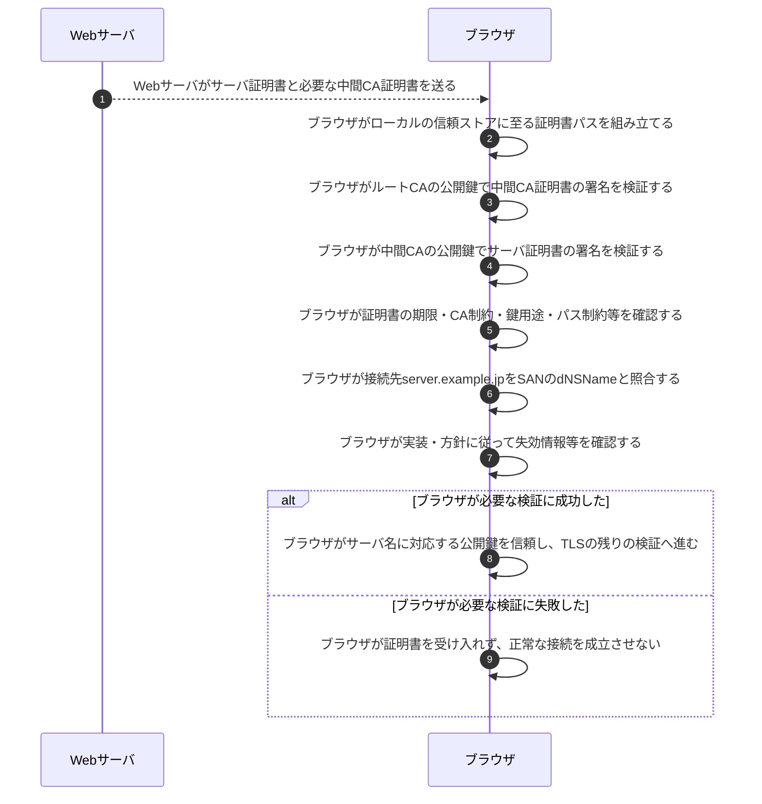

# 証明書チェーン検証

## 前提と登場人物

**Webサーバは証明書を提示し、ブラウザは自分の信頼情報で検証する。** ここでは`https://server.example.jp`へ接続し、サーバ証明書→中間CA→信頼済みルートCAという一段の中間CAの例を示す。信頼ストアはブラウザ／OS内のローカル情報であり、接続のたびに問い合わせる外部サーバではない。

TLS全体は[TLS 1.3ハンドシェイク](TLS1.3ハンドシェイク.md)を参照する。証明書の正当性と、接続相手が対応する秘密鍵を本当に持つかの確認も分けて考える。

## ブラウザが信頼の連鎖と接続先名を検証する

署名検証では、署名対象の証明書データ（tbsCertificate）・署名値・発行者の公開鍵を使う。中間CA証明書とサーバ証明書が同じかを比較するわけではない。ハッシュ処理等の詳細は署名方式によって異なる。

## 処理後に残るもの

| 主体 | 保持するもの | 相手へ渡さないもの |
|---|---|---|
| ブラウザ | 信頼ストア、受信証明書、接続先名、検証結果 | CAやWebサーバの秘密鍵は不要 |
| Webサーバ | サーバ秘密鍵、サーバ証明書、中間CA証明書 | サーバ秘密鍵をブラウザへ送らない |
| CA | 発行用秘密鍵と発行・失効情報 | CA秘密鍵は証明書に含めない |

## 注意点

ルートの自己署名が検証できるだけでは信頼の根拠にならない。**事前に信頼するという設定**が起点であり、サーバが勝手に添えたルート証明書を信用しない。

接続先がFQDNならSANの`dNSName`、IPリテラルならSANの`iPAddress`を照合する。CNだけの確認で代用しない。必要な中間証明書がないとパス構築に失敗し得るが、キャッシュ等から補える場合もある。

証明書検証に成功しただけでTLS全体が完了するわけではない。TLS 1.3では、ブラウザがCertificateVerifyで秘密鍵の保有を、Finishedで交渉と鍵の整合を確認する。[失効確認](CRLとOCSPの失効確認.md)の成否の扱いも実装・方針と区別する。

## 参照資料

- [RFC 5280 §6：証明書パス検証](https://www.rfc-editor.org/rfc/rfc5280.html)
- [RFC 9525 §6：接続先識別子の照合](https://www.rfc-editor.org/rfc/rfc9525.html)
- [RFC 8446 §4.4：TLS 1.3の認証メッセージ](https://www.rfc-editor.org/rfc/rfc8446.html)
