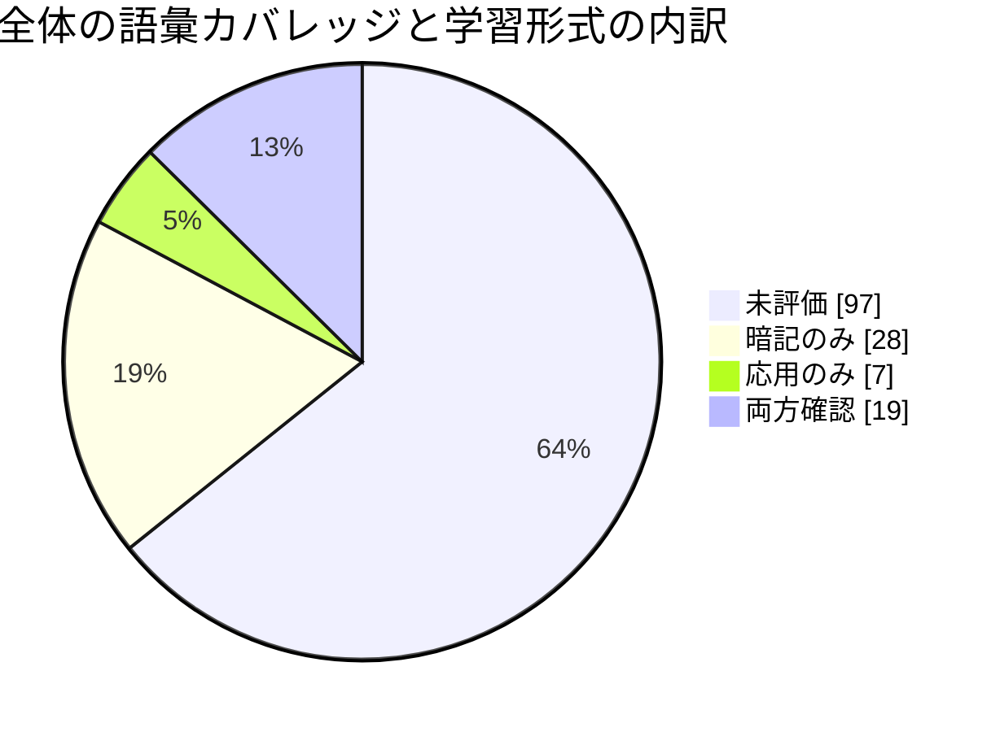

# モチベーション

カタログ語句を、未評価・暗記のみ・応用のみ・両方確認の重複しない4区分で表示します。採点時に自動更新します。

**全体**: 54 / 151 語（36%）
内訳: 暗記のみ 28語 / 応用のみ 7語 / 両方確認 19語

| 分野 | 暗記のみ | 応用のみ | 両方確認 | 未評価 | 全語彙 | カバレッジ |
|---|---:|---:|---:|---:|---:|---:|
| Webセキュリティ | 2 | 1 | 2 | 6 | 11 | 45% |
| 認証・認可 / IAM | 2 | 1 | 2 | 5 | 10 | 50% |
| 暗号 | 2 | 0 | 3 | 5 | 10 | 50% |
| PKI・証明書 | 1 | 0 | 3 | 5 | 9 | 44% |
| ネットワークセキュリティ | 2 | 1 | 1 | 7 | 11 | 36% |
| DNS | 0 | 1 | 1 | 6 | 8 | 25% |
| メールセキュリティ | 2 | 1 | 2 | 3 | 8 | 62% |
| マルウェア | 1 | 0 | 1 | 7 | 9 | 22% |
| インシデントレスポンス | 2 | 0 | 1 | 5 | 8 | 38% |
| ログ分析・監視 | 2 | 1 | 0 | 6 | 9 | 33% |
| OSセキュリティ | 2 | 0 | 0 | 7 | 9 | 22% |
| クラウドセキュリティ | 0 | 0 | 1 | 8 | 9 | 11% |
| セキュアプログラミング | 0 | 0 | 1 | 8 | 9 | 11% |
| 脆弱性管理 | 4 | 0 | 0 | 3 | 7 | 57% |
| リスク・ガバナンス | 2 | 0 | 1 | 5 | 8 | 38% |
| サプライチェーン | 1 | 0 | 0 | 5 | 6 | 17% |
| ゼロトラスト | 1 | 1 | 0 | 3 | 5 | 40% |
| フォレンジック | 2 | 0 | 0 | 3 | 5 | 40% |
