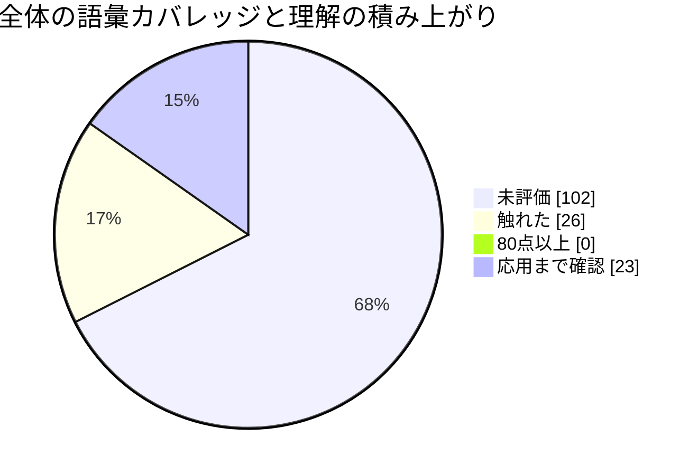

# モチベーション

カタログ語句を、未評価・触れた・80点以上・応用まで確認の4区分で表示します。通常の理解・応用問題を解いた語句は「応用まで確認」を優先し、採点時に自動更新します。

**全体**: 49 / 151 語（32%）
内訳: 触れた 26語 / 80点以上 0語 / 応用まで確認 23語

| 分野 | 評価済み | 全語彙 | カバレッジ |
|---|---:|---:|---:|
| Webセキュリティ | 4 | 11 | 36% |
| 認証・認可 / IAM | 3 | 10 | 30% |
| 暗号 | 4 | 10 | 40% |
| PKI・証明書 | 4 | 9 | 44% |
| ネットワークセキュリティ | 3 | 11 | 27% |
| DNS | 2 | 8 | 25% |
| メールセキュリティ | 5 | 8 | 62% |
| マルウェア | 2 | 9 | 22% |
| インシデントレスポンス | 3 | 8 | 38% |
| ログ分析・監視 | 3 | 9 | 33% |
| OSセキュリティ | 2 | 9 | 22% |
| クラウドセキュリティ | 1 | 9 | 11% |
| セキュアプログラミング | 1 | 9 | 11% |
| 脆弱性管理 | 4 | 7 | 57% |
| リスク・ガバナンス | 3 | 8 | 38% |
| サプライチェーン | 1 | 6 | 17% |
| ゼロトラスト | 2 | 5 | 40% |
| フォレンジック | 2 | 5 | 40% |
